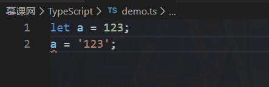
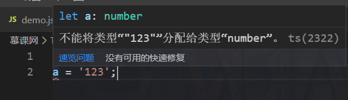
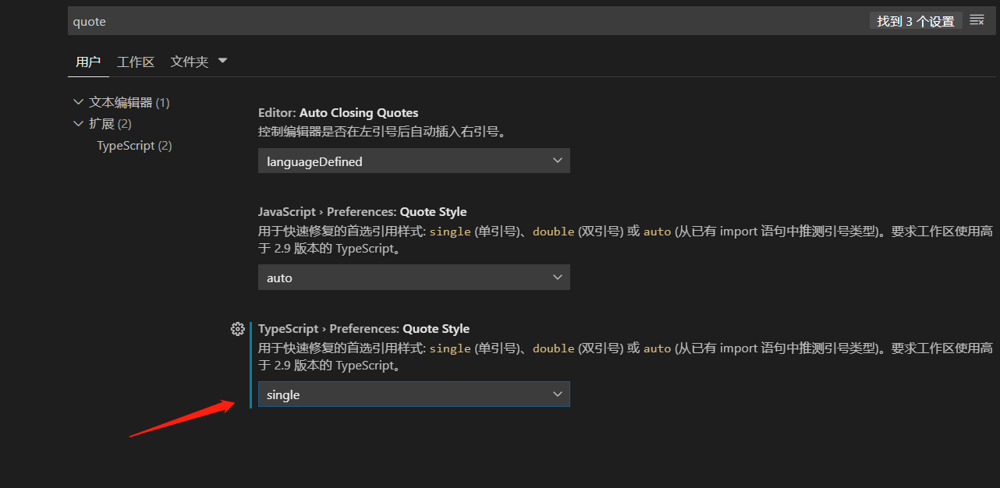
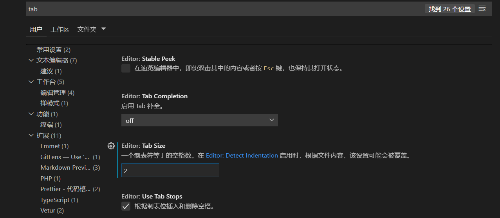

# TS

## TS 介绍

### 定义

TypeScript 是 JavaScript 的超集，拥有（静态）类型机制。
如图所示：





当我定义`a`的时候已经被定义为就只能存`number`类型， 不能存其他类型。

TypeScript 不会在浏览器直接执行， 必须通过编译器编译为 JavaScript 再执行。

### TS 带来的优势

1. 开发过程中， 发现潜在问题
2. 更友好的编辑器自动提示
3. 代码语义

### 环境配置

首先我们需要在 VScode 中进行设置，首先将引号改为单引号



tab 可选择改为 2 个字符


保存时自动格式化


需配合 Prettier - Code formatter 插件使用

#### 安装 typescript

接着我们需要安装插件

```
npm i typescript@3.6.4 -g
```

使用

```
tsc demo.ts
```

#### 编译

上面文件编译执行过程实在过于麻烦， 我们需要安装一个插件直接编译并执行

```
 npm i -g ts-node
```

使用

```
ts-node demo.ts
```

## 语法入门

### 静态类型

```ts
interface Point {
  x: number;
  y: number;
}

const point: Point = {
  x: 3,
  y: 4
};
```

point 使用了 Point 类型， 它只能为一个对象，对象内必须有且只能有`x`和`y`属性， 并且`x`和`y`必须为`number`类型。

### 基础类型和对象类型

```ts
// 基础类型 null, undefined, symbol, boolean, void
const count: number = 123;
const teacherName: string = 'Dell';

// 对象类型

const teacher: {
  name: string;
  age: number;
} = {
  name: 'Dell',
  age: 18
};

//number[]表示必须为数组， 且数组内必须是数字
const numbers: number[] = [1, 2, 3];

class Person {}
// dell必须是Person的实例。
const dell: Person = new Person();
//getTotal必须是一个函数且返回结果必须是number
const getTotal: () => number = () => {
  return 123;
};
```

### 类型注解和类型推断

```ts
// type annotation 类型注解, 我们来告诉 TS 变量是什么类型
let count: number;
count = 123;

// type inference 类型推断, TS 会自动的去尝试分析变量的类型
let countInference = 123;

const firstNumber = 1;
const secondNumber = 2;
const total = firstNumber + secondNumber;
```


```ts
const obj = {
  name: 'dell',
  age: 18
};
```

在这里我们的`obj`对象下的`name`也可以推断出是`string`类型， `age`属性为`number`类型

我们接下来来看一下另一种情况：

```ts
function getTotal(firstNumber: number, secondNumber: number) {
  return firstNumber + secondNumber;
}

const total = getTotal(1, 2);
```

在这里我们必须要为`getTotal`的参数设置类型， 因为我们不知道它传入的参数是字符串还是数字， 也就无法推断出它是哪种类型，如果我们想要传入数字则必须设置类型`number`。

设置完参数为`number`类型后，此时`total`也已经能推断出是`number`类型了， 因为我们传入的值必须是`number`数值，那么返回的结果也一定是 number 类型。

类型推断一定要写在一行才可以

```ts
// 基础类型, boolean, number, string, void, undfined, symbol, null
let count;
count = 123;
```

如上： 写在两行是不会推断出`count`是数值类型的。

### 函数相关类型

#### 返回值为数值

```ts
function add(first: number, second: number): number {
  return first + second + '';
}

const total = add(1, 2);
```


如果我们想要`add`函数返回值必须为数值可以在括号后面添加一个`number`类型， 此时如果返回的值不是`number`就会出现报错提示。如图所示，返回值是字符串进行了错误提示。


#### 返回值为空

```ts
function sayHello(): void {
  console.log('hello');
  return '';
}
```


如果有返回值就进行报错提示， 必须没有任何返回值才可以。


#### 函数永远不可能执行完

```ts
function errorEmitter(): never {
  throw new Error();
  console.log(123);
}
```

由于函数抛出错误， 不会在走到下面。此时就可以用`nerver`类型。

#### 解构类型的类型注解

```ts
function add({ first, second }: { first: number; second: number }): number {
  return first + second;
}

const total = add({ first: 1, second: 2 });
```

我们在对解构类型的参数进行类型注解一定要记得加上大括号， 尤其是在一个参数的情况下。

因为看似一个参数可以写`number`类型注解没问题， 但是如果多加入一个参数或者多个参数呢？ 所以一定要加上大括号， 直接写`number`是不对的， 会报错。

以下为正确的写法：

```ts
function getNumber({ first }: { first: number }) {
  return first;
}
const count = getNumber({ first: 1 });
```

#### 函数类型的两种写法

```ts
const func = (str: string) => {
  return parseInt(str, 10);
};

const func1: (str: string) => number = str => {
  return parseInt(str, 10);
};
```

以上两种写法意思都是参数接受为字符串， 返回结果是数值。

### 其他 case

```ts
// 其他的 case
interface Person {
  name: 'string';
}
const rawData = '{"name": "dell"}';
const newData: Person = JSON.parse(rawData);
```

使用`JSON.parse()`这种内置方法时， 并不能推断出它是什么类型， 我们需要加一个类型注解才可以。

假设我们有这样一种情况， 一开始`temp`变量为`number`类型， 但是在未来的某一个时刻需要变成字符串， 这时候 ts 就会给我们报错提示必须为`number`类型。 我们可以这样做：

```ts
let temp: number | string = 123;
temp = '456';
```

以上的意思是说`temp`既可以是`number`， 也可以是`string`类型。

### 数组与原数组

#### 数组

```ts
// 数组内容只能是数值或字符串
const arr: (number | string)[] = [1, '2', 3];
// 数组内容只能是字符串
const stringArr: string[] = ['a', 'b', 'c'];
// 数组内容只能是undefined
const undefinedArr: undefined[] = [undefined];
```

#### 类型别名

```ts
// type alias 类型别名
type User = { name: string; age: number };

const objectArr: User[] = [
  {
    name: 'dell',
    age: 28
  }
];
```

objectArr 数组内必须是对象， 且对象内必须有且只有`name`和`age`属性， 且`name`必须是`string`，`age`是`number`。

#### 元组

当有一个数组类型确定， 且长度确定的情况下可以使用元组

```ts
// 元组 tuple
const teacherInfo: [string, string, number] = ['Dell', 'male', 18];
// csv
const teacherList: [string, string, number][] = [
  ['dell', 'male', 19],
  ['sun', 'female', 26],
  ['jeny', 'female', 38]
];
```

### Interface 接口

其实 Interface 接口和类型和类型别名类似， 不过类型别名也可以为基础类型， 而 Interface 接口只能是对象或者函数。

在一般情况下， 能使用 Interface 接口就不要去使用类型别名了。

```ts
// interface 和 type 相类似，但并不完全一致
interface Person {
  name: string;
}

const getPersonName = (person: Person) => {
  console.log(person.name);
};

const setPersonName = (person: Person, name: string) => {
  person.name = name;
};
```

以下我们需要注意的点：


在我们使用字面量对象直接作为参数是，如果多增加属性会进行报错， 因为类型注解里并没有定义`sex`。但是先定义一个`person`对象再使用这个变量是没有问题的。

#### 接口其它定义方式

我们也可以这样写：

```ts
interface Person {
  // readonly 表示只能读取name， 不能修改
  readonly name: string;
  //?表示age属性可有可无
  age?: number;
  //可以添加其他属性，key值是字符串
  [propName: string]: any;
  //增加`say`方法， 返回结果必须是字符串。
  say(): string;
}
```

增加`[propName: string]: any;`， 这样就可以添加更多属性了。

#### 类应用接口

只要使用`implements`关键字就可以应用`Person`接口

```ts
class User implements Person {
  name = 'dell';
  say() {
    return 'hello';
  }
}
```

#### 接口继承

```ts
interface Teacher extends Person {
  teach(): string;
}
```

在继承 Person 接口的同时， 还必须拥有`teach()`方法， 否则报错。

#### 函数接口

```ts
interface SayHi {
  (word: string): string;
}

const say: SayHi = (word: string) => {
  return word;
};
```

`say`必须是函数，参数必须是字符串。

### 类中的访问类型和构造器

#### 访问类型

```ts
// private, protected, public 访问类型
// public 允许我在类的内外被调用
// private 允许在类内被使用
// protected 允许在类内及继承的子类中使用
class Person {
  public name: string;
  public sayHi() {
    this.name;
    console.log('hi');
  }
  private sayABC() {
    this.name;
  }
}

class Teacher extends Person {
  public sayBye() {
    this.sayHi();
  }
}
```

#### 构造器

```ts
// constructor
class Person {
  // 传统写法
  // public name: string;
  // constructor(name: string) {
  //   this.name = name;
  // }
  // 简化写法
  constructor(public name: string) {}
}
const person = new Person('dell');
console.log(person.name);
```

### 静态属性，getter, setter

#### 保护私有变量

```ts
// getter and setter
class Person {
  constructor(private _name: string) {}
  get name() {
    return this._name + ' lee';
  }
  set name(name: string) {
    const realName = name.split(' ')[0];
    this._name = realName;
  }
}

const person = new Person('dell');
console.log(person.name);
person.name = 'dell lee';
console.log(person.name);
```

`_name`是私有属性， 不对外暴露， 只在内部访问。 通过 get, set 来进行访问私有变量。

#### 实现单例模式

```ts
class Demo {
  private static instance: Demo;
  private constructor(public name: string) {}

  static getInstance() {
    if (!this.instance) {
      this.instance = new Demo('dell lee');
    }
    return this.instance;
  }
}

const demo1 = Demo.getInstance();
const demo2 = Demo.getInstance();
console.log(demo1.name);
console.log(demo2.name);
```

### 抽象类

#### readonly


使用`readonly`, 类里面的属性变的只能读不能修改。 如上，修改`person.name`会出现报错提示。

#### 抽象类


抽象类用来抽离出一些共用的属性或方法进行封装。 它不可以被实例化， 只能用来继承。

## 语法进阶

### 配置文件

默认情况下我们执行 `tsc demo.ts`是不会使用配置文件的， 只有执行`tsc`才会用配置文件执行。

如果想编译某个文件使用配置， 需要添加以下配置：

tsconfig.json 配置文件

```json
{
{
    "compilerOptions": {
        "module": "system",
        "noImplicitAny": true,
        "removeComments": true,
        "preserveConstEnums": true,
        "outFile": "../../built/local/tsc.js",
        "sourceMap": true
    },
    "include": [
       "./demo.ts"
    ],
    "exclude": [
        "node_modules",
       "./demo1.ts"
    ]
}
```

使用 include 配置， 可以使 demo.ts 使用配置文件， exclude 排除掉 demo1.ts

当然你也可以使用 file 直接指定某些文件， 具体如下：

```json
{
  "compilerOptions": {
    "module": "commonjs",
    "noImplicitAny": true,
    "removeComments": true,
    "preserveConstEnums": true,
    "sourceMap": true
  },
  "files": [
    "core.ts",
    "sys.ts",
    "types.ts",
    "scanner.ts",
    "parser.ts",
    "utilities.ts",
    "binder.ts",
    "checker.ts",
    "emitter.ts",
    "program.ts",
    "commandLineParser.ts",
    "tsc.ts",
    "diagnosticInformationMap.generated.ts"
  ]
}
```

### 编译时配置

compilerOptions 下的配置就是编译时需要的配置了

#### 配置项

```json
{
  "exclude": ["./demo.ts"], //demo.ts不使用此配置文件
  "compilerOptions": {
    /* Basic Options */
    //"incremental": true /* 只编译新增内容 */,
    "target": "es5" /* Specify ECMAScript target version: 'ES3' (default), 'ES5', 'ES2015', 'ES2016', 'ES2017', 'ES2018', 'ES2019' or 'ESNEXT'. */,
    "module": "amd" /* 使用哪种规范引入导出文件: 'none', 'commonjs', 'amd', 'system', 'umd', 'es2015', or 'ESNext'. */,
    // "lib": [],                             /* Specify library files to be included in the compilation. */
    "allowJs": true /* 编译JS文件 可把ES6语法编译为ES5 */,
    "checkJs": true /* JS语法检测*/,
    // "jsx": "preserve",                     /* Specify JSX code generation: 'preserve', 'react-native', or 'react'. */
    // "declaration": true,                   /* Generates corresponding '.d.ts' file. */
    // "declarationMap": true,                /* Generates a sourcemap for each corresponding '.d.ts' file. */
    // "sourceMap": true,                     /* Generates corresponding '.map' file. */
    "outFile": "./" /* 把所有文件输出到指定的一个文件内 */,
    "outDir": "./build" /* 将输出文件重定向到指定目录*/,
    "rootDir": "./src" /* 指定输入文件的根目录。用于使用--outDir控制输出目录 */,
    // "composite": true,                     /* Enable project compilation */
    // "tsBuildInfoFile": "./",               /* Specify file to store incremental compilation information */
    "removeComments": true /* 过滤掉注释内容 */,
    // "noEmit": true,                        /* Do not emit outputs. */
    // "importHelpers": true,                 /* Import emit helpers from 'tslib'. */
    // "downlevelIteration": true,            /* Provide full support for iterables in 'for-of', spread, and destructuring when targeting 'ES5' or 'ES3'. */
    // "isolatedModules": true,               /* Transpile each file as a separate module (similar to 'ts.transpileModule'). */

    /* Strict Type-Checking Options */
    "strict": true /* strict": true的话 Strict Type-Checking Options 以下配置都为true */,
    //"noImplicitAny": true /* 一般设置为true 表示必须显式设置类型为any  false表示可以不用显式设置 */,
    //"strictNullChecks": true /* 是否强制校验null 设置为true表示强制校验null */,
    // "strictFunctionTypes": true,           /* Enable strict checking of function types. */
    // "strictBindCallApply": true,           /* Enable strict 'bind', 'call', and 'apply' methods on functions. */
    // "strictPropertyInitialization": true,  /* Enable strict checking of property initialization in classes. */
    // "noImplicitThis": true,                /* Raise error on 'this' expressions with an implied 'any' type. */
    // "alwaysStrict": true,                  /* Parse in strict mode and emit "use strict" for each source file. */

    /* Additional Checks */
    "noUnusedLocals": true /* 对未使用的变量进行报错提示 */,
    "noUnusedParameters": true /* 对函数参数未使用进行提示 */,
    // "noImplicitReturns": true,             /* Report error when not all code paths in function return a value. */
    // "noFallthroughCasesInSwitch": true,    /* Report errors for fallthrough cases in switch statement. */

    /* Module Resolution Options */
    // "moduleResolution": "node",            /* Specify module resolution strategy: 'node' (Node.js) or 'classic' (TypeScript pre-1.6). */
    //"baseUrl": "./" /* 指定根目录是哪个目录 */,
    // "paths": {},                           /* A series of entries which re-map imports to lookup locations relative to the 'baseUrl'. */
    // "rootDirs": [],                        /* List of root folders whose combined content represents the structure of the project at runtime. */
    // "typeRoots": [],                       /* List of folders to include type definitions from. */
    // "types": [],                           /* Type declaration files to be included in compilation. */
    // "allowSyntheticDefaultImports": true,  /* Allow default imports from modules with no default export. This does not affect code emit, just typechecking. */
    "esModuleInterop": true /* Enables emit interoperability between CommonJS and ES Modules via creation of namespace objects for all imports. Implies 'allowSyntheticDefaultImports'. */
    // "preserveSymlinks": true,              /* Do not resolve the real path of symlinks. */
    // "allowUmdGlobalAccess": true,          /* Allow accessing UMD globals from modules. */

    /* Source Map Options */
    // "sourceRoot": "",                      /* Specify the location where debugger should locate TypeScript files instead of source locations. */
    // "mapRoot": "",                         /* Specify the location where debugger should locate map files instead of generated locations. */
    // "inlineSourceMap": true,               /* Emit a single file with source maps instead of having a separate file. */
    // "inlineSources": true,                 /* Emit the source alongside the sourcemaps within a single file; requires '--inlineSourceMap' or '--sourceMap' to be set. */

    /* Experimental Options */
    // "experimentalDecorators": true,        /* Enables experimental support for ES7 decorators. */
    // "emitDecoratorMetadata": true,         /* Enables experimental support for emitting type metadata for decorators. */
  }
}
```

### 类型保护

#### 类型断言的方式

在我们写代码时， 有可能遇到以下情况：

我们定义了两个类型接口， 我们对一个参数进行类型注解， 但是使用`animal.sing()`会出现报错。 因为 Dog 接口内根本就没有`sing()`方法。


如果要解决这个问题， 我们必须让它强制使用 Brid 接口才可以。 在原有参数后面添加 `as` 和 接口名来强制它使用这个接口。并添加括号。

```ts
interface Brid {
  fly: boolean;
  sing: () => {};
}

interface Dog {
  fly: boolean;
  bark: () => {};
}

function trainAnial(animal: Brid | Dog) {
  if (animal.fly) {
    (animal as Brid).sing();
  } else {
    (animal as Dog).bark();
  }
}
```

#### in 语法做类型保护

我们还可以使用`in`语法做类型保护。

```ts
interface Brid {
  fly: boolean;
  sing: () => {};
}

interface Dog {
  fly: boolean;
  bark: () => {};
}

function trainAnial(animal: Brid | Dog) {
  if ('sing' in animal) {
    animal.sing();
  } else {
    animal.bark();
  }
}
```

#### typeof 语法 类型保护

```ts
interface Brid {
  fly: boolean;
  sing: () => {};
}

interface Dog {
  fly: boolean;
  bark: () => {};
}

function add(first: string | number, second: string | number) {
  if (typeof first === 'string' || typeof second === 'string') {
    return `${first}${second}`;
  }
  return first + second;
}
```

#### 使用 instanceof 类型保护

这里注意要使用类`class`， 而不是接口`interface`

```ts
class numberObj {
  count: number;
}

function addSecond(first: object | numberObj, second: object | numberObj) {
  if (first instanceof numberObj && second instanceof numberObj) {
    return first.count + second.count;
  }
  return 0;
}
```

### 枚举类型

如果 `OFFLINE`不设置直接默认从 0 开始， 对应的值就是 0 ，1， 2。

如果`OFFLINE`设置为 1， 将从 1 开始， 下面的值对应的是 1, 2, 3。

如果设置`ONLINE`为 4， 那么`DELETED`的值对应 +1， 也就是 5。

```ts
enum Status {
  OFFLINE = 1,
  ONLINE,
  DELETED
}

console.log(Status.OFFLINE, Status[1]);
```

而且这样写枚举类型， 正反向都是可以获取键和值得。

### 函数泛型

```ts
// 泛型 generic 泛指的类型
function join<ABC>(first: ABC, second: ABC) {
  return `${first}${second}`;
}

join<string>('1', '1');
```

如果我们想要在调用函数的时候再确定传参的类型， 可以使用泛型。 如上图所示：在调用`join`函数时传入`string`类型， 那么它的参数必须是字符串， 否则就会报错。

我们来看另一种泛型的用法：

```ts
function map<T>(params: Array<T>) {
  return params;
}

map<string>(['123']);
```

以上在定义函数参数时， 把`params`定义为了一个数组，并且里面的`T`代表的正是`string`。所以在传值时数组内必须是字符串。

它还有另一种写法：

```ts
function map<T>(params: T[]) {
  return params;
}

map<string>(['123']);
```

#### 泛型 - 多个参数

```ts
function join<T, P>(first: T, second: P) {
  return `${first}${second}`;
}

// join<number, string>(1, '1');
join(1, '1');
```

以上代码定义了两个泛型， 第一个为`number`, 第二个为`string`。 当然你调用时不写也是可以的， 那么 TS 会进行类型推断， 根据你传入的参数进行判断是什么类型。

当然， 我们也可以利用泛型做一个函数返回值的类型约束。

```ts
function join<T, P>(first: T, second: P): P {
  return second;
}

join<number, string>(1, '1');
```

### 类里面的泛型

```ts
class DataManager {
  constructor(private data: string[] | number[]) {}
  getItem(index: number): string | number {
    return this.data[index];
  }
}

const data = new DataManager([1]);
data.getItem(0);
```

在我们定义一个类时， 很可能遇到以上情况， 我们传入数组的值不固定， 有可能是`string`, `number`,`object`等等。 如果不断地在类里面的构造函数添加类型会变的非常麻烦， 这时候我们就可以使用泛型了。

```ts
class DataManager<T> {
  constructor(private data: T[]) {}
  getItem(index: number): T {
    return this.data[index];
  }
}

const data = new DataManager<number>([1]);
data.getItem(0);
```

使用泛型后， 在实例化时确定传入的参数为`number`。

#### 继承

我们来看另外一种情况：


由于我们不能确定 data[index]是不是有`name`属性， 所以会出现报错提示。如果想解决这个问题， 我们可以这么做：

```ts
interface Item {
  name: string;
}
class DataManager<T extends Item> {
  constructor(private data: T[]) {}
  getItem(index: number): string {
    return this.data[index].name;
  }
}

const data = new DataManager([
  {
    name: 'dell'
  }
]);
```

`T` 泛型必须要有 `Item`里面的东西。

我们也可以这样继承：

```ts
class DataManager<T extends number | string> {
  constructor(private data: T[]) {}
  getItem(index: number): T {
    return this.data[index];
  }
}

const data = new DataManager<number>([1]);
```

这样`T`泛型就继承了`number`和`string`。

#### 如何使用泛型作为一个具体的类型注解

```ts
function hello<T>(params: T) {
  return params;
}

const func: <T>(param: T) => T = hello;
```

### 命名空间

在我们写代码时， 可能有很多变量会变成全局变量， 污染全局环境， 在这种情况下我们就可以使用命名空间了， 具体使用如下：

```ts
namespace Home {
  class Header {
    constructor() {
      const elem = document.createElement('div');
      elem.innerText = 'This is Header';
      document.body.appendChild(elem);
    }
  }

  class Content {
    constructor() {
      const elem = document.createElement('div');
      elem.innerText = 'This is Content';
      document.body.appendChild(elem);
    }
  }

  class Footer {
    constructor() {
      const elem = document.createElement('div');
      elem.innerText = 'This is Footer';
      document.body.appendChild(elem);
    }
  }

  export class Page {
    constructor() {
      new Header();
      new Content();
      new Footer();
    }
  }
}
```

把所有的类都放在`HOME`命名空间下， 只把`Page` 暴露出去。

```js
new Home.Page();
```

直接实例化`Home`下的`page`就可以了。

---

我们如果想实例化另外一个模块的类该怎么办呢？

可以考虑以下方法：

具体目录如下：


components.ts

```ts
namespace Components {
  export interface user {
    name: string;
  }

  export class Header {
    constructor() {
      const elem = document.createElement('div');
      elem.innerText = 'This is Header';
      document.body.appendChild(elem);
    }
  }

  export class Content {
    constructor() {
      const elem = document.createElement('div');
      elem.innerText = 'This is Content';
      document.body.appendChild(elem);
    }
  }

  export class Footer {
    constructor() {
      const elem = document.createElement('div');
      elem.innerText = 'This is Footer';
      document.body.appendChild(elem);
    }
  }
}
```

page.ts

```ts{1}
///<reference path="components.ts" />

namespace Home {
  export namespace Dell {
    export const teacher: Components.user = {
      name: 'dell'
    };
  }
  export class Page {
    constructor() {
      new Components.Header();
      new Components.Content();
      new Components.Footer();
      new Components.Footer();
    }
  }
}
```


我们将所有文件都编译为一个文件， 采用 amd 规范。这样就可以使用另外一个模块的内容了。

在我们的 index.html 进行引入已经编译好的 js 文件

```html
<!DOCTYPE html>
<html lang="en">
  <head>
    <meta charset="UTF-8" />
    <title>Document</title>
    <script src="./dist/page.js"></script>
  </head>
  <body>
    <script>
      new Home.Page();
    </script>
  </body>
</html>
```

这样就可以在页面打印出我们想要的内容了


### import 模块化

具体目录如下：


components.ts

```ts
export class Header {
  constructor() {
    const elem = document.createElement('div');
    elem.innerText = 'This is Header';
    document.body.appendChild(elem);
  }
}

export class Content {
  constructor() {
    const elem = document.createElement('div');
    elem.innerText = 'This is Content';
    document.body.appendChild(elem);
  }
}

export class Footer {
  constructor() {
    const elem = document.createElement('div');
    elem.innerText = 'This is Footer';
    document.body.appendChild(elem);
  }
}
```

page.ts

```ts
import { Header, Content, Footer } from './components';

export default class Page {
  constructor() {
    new Header();
    new Content();
    new Footer();
  }
}
```

index.html

```html
<!DOCTYPE html>
<html lang="en">
  <head>
    <meta charset="UTF-8" />
    <title>Document</title>
    <script src="https://cdn.bootcss.com/require.js/2.3.6/require.js"></script>
    <script src="./dist/page.js"></script>
  </head>

  <body>
    <script>
      require(['page'], function(page) {
        new page.default();
      });
    </script>
  </body>
</html>
```

### Parcel 打包 TS 代码

我们可以利用 Parcel 打包 TS 代码， 它可以让我们在 HTML 文件内直接引入 TS 文件， 并转义出我们需要的 JS 代码， 使操作更加简便。

我们首先需要安装`parcel`这个插件。

使用命令如下：

```json
  "scripts": {
    "test": "parcel ./src/index.html"
  }
```

做好相应的 tsconfig.json 配置

```json
    "outDir": "./dist" /* Redirect output structure to the directory. */,
    "rootDir": "./src" /
```

page.ts

```ts
const teacher: string = 'dell';
console.log(teacher);
```

在相应的 html 文件内引入：

```html
<!DOCTYPE html>
<html lang="en">
  <head>
    <meta charset="UTF-8" />
    <meta name="viewport" content="width=device-width, initial-scale=1.0" />
    <meta http-equiv="X-UA-Compatible" content="ie=edge" />
    <title>Document</title>
    <script src="./page.ts"></script>
  </head>
  <body></body>
</html>
```

输出结果：


再去看 Sources 相应的 TS 资源文件已经被转换为 JS 文件了。

### 描述文件中的全局类型

我们如果想使用 jQuery， 首先在 html 文件内引入， 但在 ts 中使用会报错， 因为 jQuery 并不是 TS， 它识别不了。 我们需要对 jQuery 做些描述让它能够使用。 具体如下：

index.html

```html
<!DOCTYPE html>
<html lang="en">
  <head>
    <meta charset="UTF-8" />
    <meta name="viewport" content="width=device-width, initial-scale=1.0" />
    <meta http-equiv="X-UA-Compatible" content="ie=edge" />
    <title>Document</title>
    <script src="https://cdn.bootcss.com/jquery/3.4.1/jquery.js"></script>
    <script src="./page.ts"></script>
  </head>
  <body></body>
</html>
```

jquery.d.ts

```ts
// 定义全局变量
// declare var $: (param: () => void) => void;

// 定义全局函数
interface JqueryInstance {
  html: (html: string) => JqueryInstance;
}

// 函数重载
declare function $(readyFunc: () => void): void;
declare function $(selector: string): JqueryInstance;

// 如何对对象进行类型定义, 以及对类进行类型定义, 以及命名空间的嵌套
declare namespace $ {
  namespace fn {
    class init {}
  }
}

// 使用interface接口的语法， 实现函数重载
// interface jQuery {
//   (readyFunc: () => void) : void;
//   (selector: string) : JqueryInstance;
// }
// declare var $: jQuery;
```

page.ts

```ts
$(function() {
  $('body').html('<div>123</div>');
});
```

这样就可以在 page.ts 内使用 jQuery 了。

### ES6 模块化

我们怎么在 TS 内使用模块化呢？具体使用如下：

jquery.d.ts

```ts
// Es6 模块化
declare module 'jquery' {
  interface JqueryInstance {
    html: (html: string) => JqueryInstance;
  }
  // 混合类型
  function $(readyFunc: () => void): void;
  function $(selector: string): JqueryInstance;
  namespace $ {
    namespace fn {
      class init {}
    }
  }
  export = $;
}
```

page.ts

```ts
import $ from 'jquery';

$(function() {
  $('body').html('<div>123</div>');
  new $.fn.init();
});
```

### 泛型中 keyof 语法的使用

如果你有一个类里面有一个对象， 然后你想根据 index，或者 key 值获取对象里的某一个内容的时候， 又想推断出争取的返回内容类型的时候， 那么你可以使用 keyof。具体使用如下：

```ts
interface Person {
  name: string;
  age: number;
  gender: string;
}

// type NAME = 'name';
// key: 'name';
// Person['name'];

// type T = 'age'
// key: 'age'
// Person['age']

// type T = 'gender'
// key: 'gender'
// Person['gender']

class Teacher {
  constructor(private info: Person) {}
  getInfo<T extends keyof Person>(key: T): Person[T] {
    return this.info[key];
  }
}

const teacher = new Teacher({
  name: 'dell',
  age: 18,
  gender: 'male'
});

const test = teacher.getInfo('name'); //string类型
const test1 = teacher.getInfo('age'); //number类型
const test2 = teacher.getInfo('gender'); //string类型
// const test3 = teacher.getInfo('hello');//报错
console.log(test);
```

## 装饰器

### 类装饰器

装饰器本身是一个函数， 它通过`@`符号来使用。

如果想要使用装饰器， 首先要开启以下设置：


装饰器只在类定义的时候起作用 ， 并不是实例化的时候。

```ts
// 类的装饰器
// 类装饰器接受的参数是构造函数
function testDecorator(flag: boolean) {
  if (flag) {
    return function(constructor: any) {
      constructor.prototype.getName = () => {
        console.log('dell');
      };
    };
  } else {
    return function(constructor: any) {};
  }
}

@testDecorator(true)
class Test {}

const test = new Test();
(test as any).getName();
```

我们接下来看一种更标准的装饰器写法：

index.ts

```ts
function testDecorator() {
  return function<T extends new (...args: any[]) => any>(constructor: T) {
    return class extends constructor {
      name = 'lee';
      getName() {
        return this.name;
      }
    };
  };
}

const Test = testDecorator()(
  class {
    name: string;
    constructor(name: string) {
      this.name = name;
    }
  }
);

const test = new Test('dell');
console.log(test.getName());
```

### 方法装饰器

index.ts

```ts
// 普通方法，target 对应的是类的 prototype
// 静态方法，target 对应的是类的构造函数

function getNameDecorator(
  target: any,
  key: string,
  descriptor: PropertyDescriptor
) {
  // console.log(target, key);
  // descriptor.writable = true;
  descriptor.value = function() {
    return 'decorator';
  };
}

class Test {
  name: string;
  constructor(name: string) {
    this.name = name;
  }
  @getNameDecorator
  getName() {
    return this.name;
  }
}

const test = new Test('dell');
console.log(test.getName());
```

### 访问器的装饰器

```ts
function visitDecorator(
  target: any,
  key: string,
  descriptor: PropertyDescriptor
) {
  // descriptor.writable = false;
}

class Test {
  private _name: string;
  constructor(name: string) {
    this._name = name;
  }
  get name() {
    return this._name;
  }
  @visitDecorator
  set name(name: string) {
    this._name = name;
  }
}

const test = new Test('dell');
test.name = 'dell lee';
console.log(test.name);
```

### 属性装饰器

```ts
// function nameDecorator(target: any, key: string): any {
//   const descriptor: PropertyDescriptor = {
//     writable: false
//   };
//   return descriptor;
// }

// test.name = 'dell lee';

// 修改的并不是实例上的 name， 而是原型上的 name
function nameDecorator(target: any, key: string): any {
  target[key] = 'lee';
}

// name 放在实例上
class Test {
  @nameDecorator
  name = 'Dell';
}

const test = new Test();
console.log((test as any).__proto__.name);
```

### 参数装饰器

```ts
// 原型，方法名，参数所在的位置
function paramDecorator(target: any, method: string, paramIndex: number) {
  console.log(target, method, paramIndex);
}

class Test {
  getInfo(name: string, @paramDecorator age: number) {
    console.log(name, age);
  }
}

const test = new Test();
test.getInfo('Dell', 30);
```

### 使用案例

```ts
const userInfo: any = undefined;

function catchError(msg: string) {
  return function(target: any, key: string, descriptor: PropertyDescriptor) {
    const fn = descriptor.value;
    descriptor.value = function() {
      try {
        fn();
      } catch (e) {
        console.log(msg);
      }
    };
  };
}

class Test {
  @catchError('userInfo.name 不存在')
  getName() {
    return userInfo.name;
  }
  @catchError('userInfo.age 不存在')
  getAge() {
    return userInfo.age;
  }
  @catchError('userInfo.gender 不存在')
  getGender() {
    return userInfo.gender;
  }
}

const test = new Test();
test.getName();
test.getAge();
```

## 项目实战（编写爬虫工具）

### 获取页面内容

`superagent`插件主要用来获取页面内容。

#### js 文件编译

由于引入文件时 JS 文件写的， 在 TS 内引入会出错。

如果我们在 TS 内需要安装一个`superagent`插件。需要编译文件才行， 滑到报错提示安装编译后的文件。如下：

```
npm i @types/superagent
```

### 分析页面信息

需要安装`cheerio`插件

```
npm i cheerio
```

#### 编译运行

我们需要安装`nodemon`和`concurrently`。

```json
  "scripts": {
    "build": "tsc -w",
    "start": "nodemon node ./build/crowller.js",
    "dev": "concurrently npm:dev:*"
  },
  "nodemonConfig": {
    "ignore": [
      "data/*"
    ]
  },
```

tsc -w 自动把 TS 文件编译为 JS 文件， nodemon 用来自动执行编译好的文件。 把两个操作合并到一块执行可以使用`concurrently`插件。`npm:dev:*`指的是执行`dev`下的所有命令。也可以这样写：

```
"dev": "concurrently npm run dev:build & npm run dev:start"
```

只执行这两个命令。

我们还可以做到这样， 先执行某一条命令， 然后再合并执行两个命令：

```json
"dev": "tsc && concurrently npm:dev:*"
```

这样就会先执行一遍 tsc 在执行另外那两条命令。
