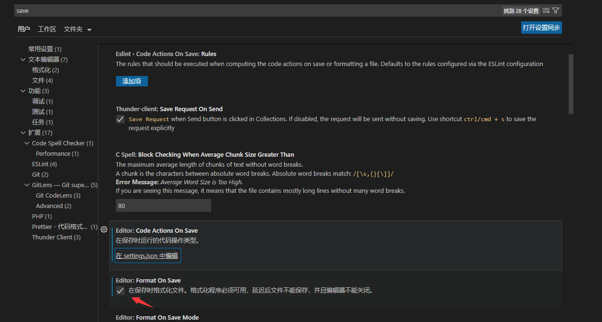
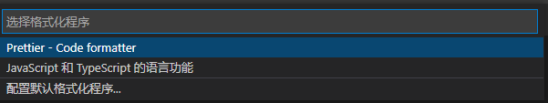
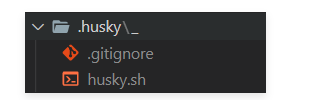

# 后台通用提效解决方案

## 编程规范

### git 提交格式

```js
module.exports = {
  // 可选类型
  types: [
    { value: "feat", name: "feat:     新功能" },
    { value: "fix", name: "fix:      修复" },
    { value: "docs", name: "docs:     文档变更" },
    { value: "style", name: "style:    代码格式(不影响代码运行的变动)" },
    {
      value: "refactor",
      name: "refactor: 重构(既不是增加feature，也不是修复bug)",
    },
    { value: "perf", name: "perf:     性能优化" },
    { value: "test", name: "test:     增加测试" },
    { value: "chore", name: "chore:    构建过程或辅助工具的变动" },
    { value: "revert", name: "revert:   回退" },
    { value: "build", name: "build:    打包" },
  ],
  // 消息步骤
  messages: {
    type: "请选择提交类型:",
    customScope: "请输入修改范围(可选):",
    subject: "请简要描述提交(必填):",
    body: "请输入详细描述(可选):",
    footer: "请输入要关闭的issue(可选):",
    confirmCommit: "确认使用以上信息提交？(y/n/e/h)",
  },
  // 跳过问题
  skipQuestions: ["body", "footer"],
  // subject文字长度默认是72
  subjectLimit: 72,
};
```

### vscode 保存自动格式化

#### eslint

VSCode 进行扩展设置，依次点击 文件 > 首选项 > 设置 打开 VSCode 配置文件,添加如下配置
此种方式只能做一些简单的格式化。

```

    "files.autoSave":"off",
    "eslint.validate": [
       "javascript",
       "javascriptreact",
       "html",
       { "language": "vue", "autoFix": true }
     ],
     "eslint.options": {
        "plugins": ["html"]
     }

```

#### prettier

在 VsCode 安装 prettier 插件，安装后在项目根目录下创建.prettierrc 文件

```

{
"semi": false,
"singleQuote": true,
"trailingComma": "none"
}

```

可设置不同的规则，详见文档。


勾选 VsCode 的保存格式化选项。
在配置完成后可在项目文件内右键配置默认的格式化程序，此后便可以保存立即进行格式化了。


### git 提交自动格式化

#### husky

[husky](https://github.com/typicode/husky)：是`git hooks`工具。
注意：**`npm` 需要在 7.x 以上版本！！！！！**

1.  安装依赖：

```

npm install husky@7.0.1 --save-dev

```

2.  启动 `hooks` ， 生成 `.husky` 文件夹

```

npx husky install

```



3.  在 `package.json` 中生成 `prepare` 指令（ **需要 npm > 7.0 版本** ）

```

npm set-script prepare "husky install"

```


4.  执行 `prepare` 指令

```

npm run prepare

```

5.  执行成功，提示
    
6.  执行 `npx husky add .husky/pre-commit "npx eslint --ext .js,.vue src"` 添加 `commit` 时的 `hook` （`npx eslint --ext .js,.vue src` 会在执行到该 hook 时运行）
7.  该操作会生成对应文件 `pre-commit`：
   
8.  修改 `package.json` 配置

```javascript
"lint-staged": {
    "src/**/*.{js,vue}": [
      "eslint --fix",
      "git add"
    ]
  }
```

9.  如上配置，每次它只会在你本地 `commit` 之前，校验你提交的内容是否符合你本地配置的 `eslint`规则(这个见文档 [ESLint](https://panjiachen.github.io/vue-element-admin-site/zh/guide/advanced/eslint.html) )，校验会出现两种结果：
1.  如果符合规则：则会提交成功。
1.  如果不符合规则：它会自动执行 `eslint --fix` 尝试帮你自动修复，如果修复成功则会帮你把修复好的代码提交，如果失败，则会提示你错误，让你修好这个错误之后才能允许你提交代码。
1.  修改 `.husky/pre-commit` 文件

```javascript
#!/bin/sh
. "$(dirname "$0")/_/husky.sh"

npx lint-staged
```
