# TCP/IP 的分层管理

TCP/IP 协议族里重要的一点就是分层。TCP/IP 协议族按层次分别分 为以下 4 层：**应用层、传输层、网络层和数据链路层。**
把 TCP/IP 层次化是有好处的。比如，如果互联网只由一个协议统 筹，某个地方需要改变设计时，就必须把所有部分整体替换掉。而分 层之后只需把变动的层替换掉即可。**把各层之间的接口部分规划好之 后，每个层次内部的设计就能够自由改动了。 **
值得一提的是，层次化之后，设计也变得相对简单了。处于应用层上 的应用可以只考虑分派给自己的任务，而不需要弄清对方在地球上哪 个地方、对方的传输路线是怎样的、是否能确保传输送达等问题。

TCP/IP 协议族各层的作用如下。

## 应用层

**应用层决定了向用户提供应用服务时通信的活动。**
TCP/IP 协议族内预存了各类通用的应用服务。比如，FTP（File Transfer Protocol，文件传输协议）和 DNS（Domain Name System，域名系统）服务就是其中两类。**HTTP 协议也处于该层。**

## 传输层

**传输层对上层应用层，提供处于网络连接中的两台计算机之间的数据传输。**
**在传输层有两个性质不同的协议：TCP（Transmission Control Protocol，传输控制协议）和 UDP（User Data Protocol，用户数据报协议）。**

## 网络层（又名网络互连层）

**网络层用来处理在网络上流动的数据包**。
数据包是网络传输的最小数据单位。该层规定了通过怎样的路径（所谓的传输路线）到达对方计算机，并把数据包传送给对方。
与对方计算机之间通过多台计算机或网络设备进行传输时，网络层所起的作用就是在众多的选项内选择一条传输路线。

## 链路层（又名数据链路层，网络接口层）

**用来处理连接网络的硬件部分。**包括控制操作系统、硬件的设备驱动、NIC（Network Interface Card，网络适配器，即网卡），及光纤等物理可见部分（还包括连接器等一切传输媒介）。硬件上的范畴均在链路层的作用范围之内。

# TCP/IP 通信传输流

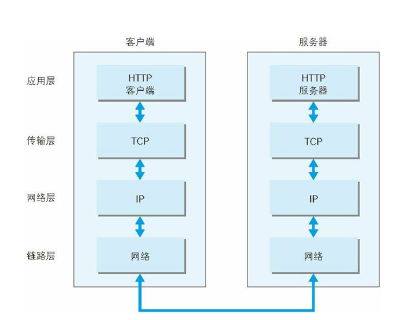

利用 TCP/IP 协议族进行网络通信时，会通过分层顺序与对方进行通 信。发送端从应用层往下走，接收端则往应用层往上走。  
我们用 HTTP 举例来说明，首先作为发送端的客户端在应用层（HTTP 协议）发出一个想看某个 Web 页面的 HTTP 请求。
接着，为了传输方便，在传输层（TCP 协议）把从应用层处收到的数据（HTTP 请求报文）进行分割，并在各个报文上打上标记序号及端口号后转发给网络层。
在网络层（IP 协议），增加作为通信目的地的 MAC 地址后转发给链路层。
这样一来，发往网络的通信请求就准备齐全了。
接收端的服务器在链路层接收到数据，按序往上层发送，一直到应用层。
当传输到应用层，才能算真正接收到由客户端发送过来的 HTTP 请求。
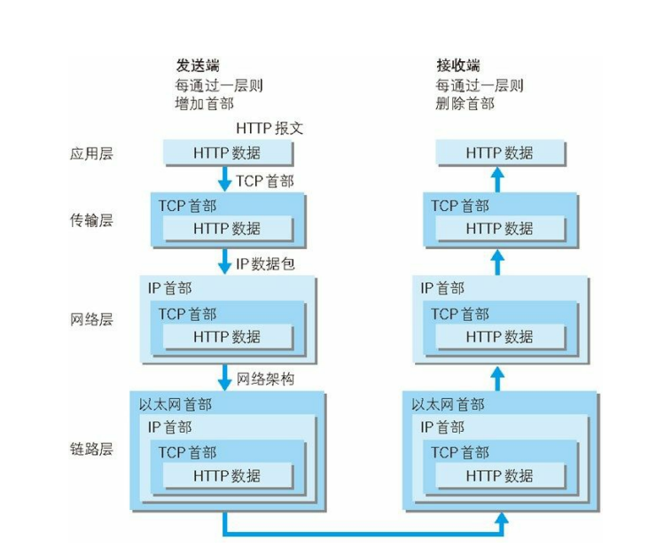

发送端在层与层之间传输数据时，每经过一层时必定会被打上一个该层所属的首部信息。
反之，接收端在层与层传输数据时，每经过一层时会把对应的首部消去。
这种把数据信息包装起来的做法称为封装（encapsulate）。

# 与 HTTP 关系密切的协议 : IP、TCP 和 DNS

## IP

IP 协议的作用是把各种数据包传送给对方。而要保证确实传送到对方 那里，则需要满足各类条件。其中两个重要的条件是 IP 地址和 MAC 地址（Media Access Control Address）。  
IP 地址指明了节点被分配到的地址，MAC 地址是指网卡所属的固定 地址。IP 地址可以和 MAC 地址进行配对。IP 地址可变换，但 MAC 地址基本上不会更改。

### ARP 协议

IP 间的通信依赖 MAC 地址。在网络上，通信的双方在同一局域网 （LAN）内的情况是很少的，通常是经过多台计算机和网络设备中转 才能连接到对方。而在进行中转时，会利用下一站中转设备的 MAC 地址来搜索下一个中转目标。这时，会采用 ARP 协议（Address Resolution Protocol）。**ARP 是一种用以解析地址的协议，根据通信方 的 IP 地址就可以反查出对应的 MAC 地址。 **

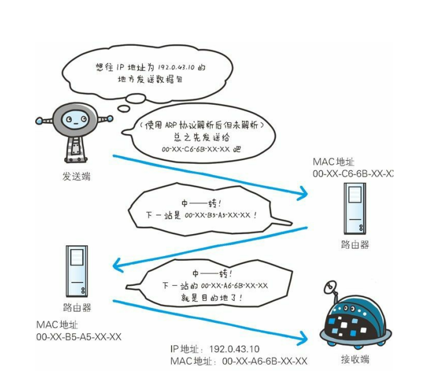

## TCP 协议

按层次分，TCP 位于传输层，提供可靠的字节流服务。
所谓的字节流服务（Byte Stream Service）是指，为了方便传输，将大 块数据分割成以报文段（segment）为单位的数据包进行管理。而可 靠的传输服务是指，能够把数据准确可靠地传给对方。一言以蔽之， **TCP 协议为了更容易传送大数据才把数据分割，而且 TCP 协议能够 确认数据最终是否送达到对方。 **

为了准确无误地将数据送达目标处，TCP 协议采用了三次握手 （three-way handshaking）策略。用 TCP 协议把数据包送出去后，TCP 不会对传送后的情况置之不理，它一定会向对方确认是否成功送达。

握手过程中使用了 TCP 的标志（flag） —— **SYN（synchronize） 和 ACK（acknowledgement）**。

**发送端首先发送一个带 SYN 标志的数据包给对方。接收端收到后， 回传一个带有 SYN/ACK 标志的数据包以示传达确认信息。最后，发送端再回传一个带 ACK 标志的数据包，代表“握手”结束。 **

若在握手过程中某个阶段莫名中断，TCP 协议会再次以相同的顺序发 送相同的数据包。

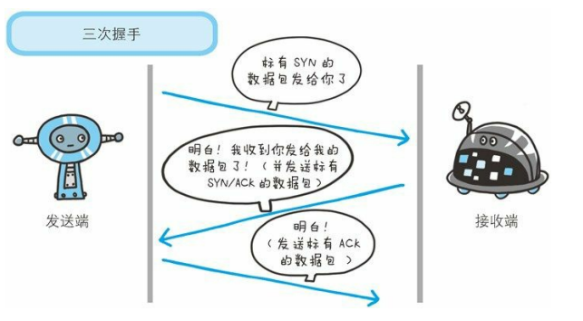

除了上述三次握手，TCP 协议还有其他各种手段来保证通信的可靠性。

## 负责域名解析的 DNS 服务

DNS（Domain Name System）服务是和 HTTP 协议一样位于应用层的 协议。它**提供域名到 IP 地址之间的解析服务。**
计算机既可以被赋予 IP 地址，也可以被赋予主机名和域名。比如 [www.hackr.jp](https://www.hackr.jp)。

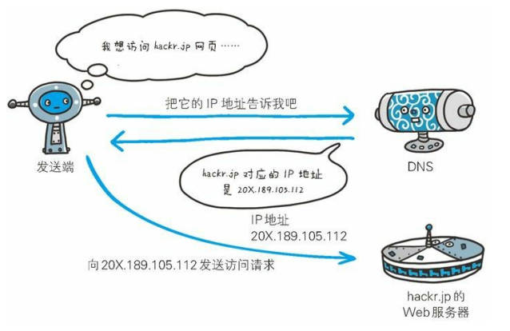

# 各种协议与 HTTP 协议的关系

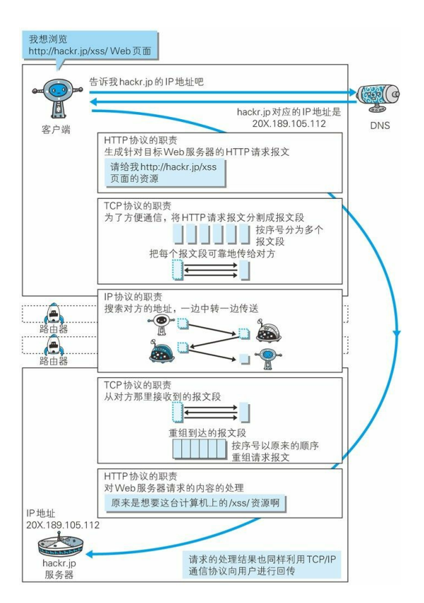

# URI 和 URL

与 URI（统一资源标识符）相比，我们更熟悉 URL（Uniform Resource Locator，统一资源定位符）。URL 正是使用 Web 浏览器等 访问 Web 页面时需要输入的网页地址。

## 统一资源标识符

URI 就是由某个协议方案表示的资源的定位标识符。协议 方案是指访问资源所使用的协议类型名称。

URI 用字符串标识某一互联网资源，而 URL 表示资源的地点（互联网上所处的位置）。可见 URL 是 URI 的子集。

# HTTP 协议

## 请求报文

请求报文是由请求方法、请求 URI、协议版本、可选的请求首部字段 和内容实体构成的。  
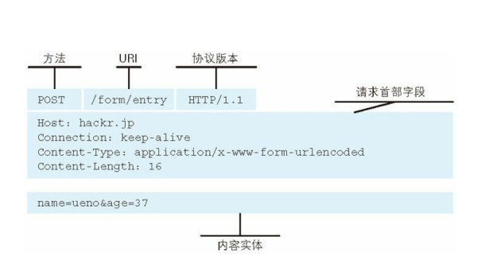

## 响应报文

响应报文基本上由协议版本、状态码（表示请求成功或失败的数字代 码）、用以解释状态码的原因短语、可选的响应首部字段以及实体主 体构成。

## HTTP 是不保存状态的协议

HTTP 是一种不保存状态，即无状态（stateless）协议。HTTP 协议自身不对请求和响应之间的通信状态进行保存。也就是说在 HTTP 这个 级别，协议对于发送过的请求或响应都不做持久化处理。  
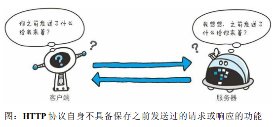

## 告知服务器意图的 HTTP 方法

1.  GET ：获取资源
1.  POST：传输实体主体
1.  PUT：传输文件
1.  HEAD：获得报文首部
1.  DELETE：删除文件
1.  OPTIONS：询问支持的方法
1.  TRACE：追踪路径
1.  CONNECT：要求用隧道协议连接代理

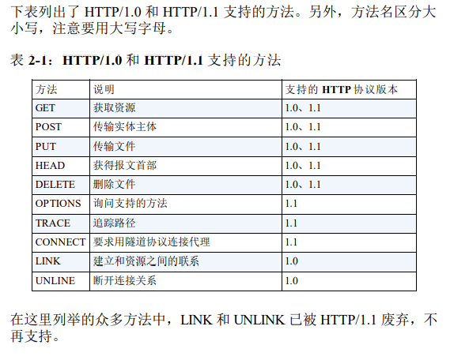

## 持久连接

HTTP 协议的初始版本中，每进行一次 HTTP 通信就要断开一次 TCP 连接。

### 持久连接

为解决上述 TCP 连接的问题，HTTP/1.1 和一部分的 HTTP/1.0 想出了 持久连接（HTTP Persistent Connections，也称为 HTTP keep-alive 或 HTTP connection reuse）的方法。**持久连接的特点是，只要任意一端 没有明确提出断开连接，则保持 TCP 连接状态。 **
在 HTTP/1.1 中，所有的连接默认都是持久连接，但在 HTTP/1.0 内并 未标准化。虽然有一部分服务器通过非标准的手段实现了持久连接， 但服务器端不一定能够支持持久连接。毫无疑问，除了服务器端，客 户端也需要支持持久连接。

### 管线化

持久连接使得多数请求以管线化（pipelining）方式发送成为可能。从 前发送请求后需等待并收到响应，才能发送下一个请求。管线化技术 出现后，不用等待响应亦可直接发送下一个请求。
这样就能够做到同时并行发送多个请求，而不需要一个接一个地等待 响应了。  
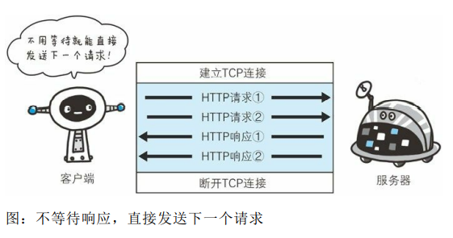

# HTTP 报文内的 HTTP 信息

## HTTP 报文

用于 HTTP 协议交互的信息被称为 HTTP 报文。请求端（客户端）的 HTTP 报文叫做请求报文，响应端（服务器端）的叫做响应报文。 HTTP 报文本身是由多行（用 CR+LF 作换行符）数据构成的字符串文 本。 HTTP 报文大致可分为报文首部和报文主体两块。两者由最初出现的 空行（CR+LF）来划分。通常，并不一定要有报文主体。

## 请求报文及响应报文的结构

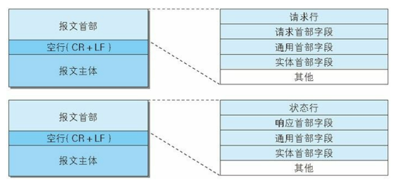

图：请求报文（上）和响应报文（下）的结构

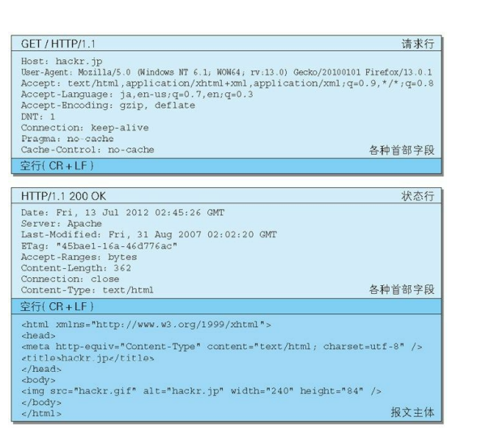 

请求报文和响应报文的首部内容由以下数据组成。现在出现的各种首 部字段及状态码稍后会进行阐述。

- 请求行： 包含用于请求的方法，请求 URI 和 HTTP 版本。 
- 状态行： 包含表明响应结果的状态码，原因短语和 HTTP 版本。 
- 首部字段： 包含表示请求和响应的各种条件和属性的各类首部。
- 一般有 4 种首部，分别是：通用首部、请求首部、响应首部和实体首部。
- 其他： 可能包含 HTTP 的 RFC 里未定义的首部（Cookie 等）。

### 压缩传输的内容编码

向待发送邮件内增加附件时，为了使邮件容量变小，我们会先用 ZIP压缩文件之后再添加附件发送。HTTP 协议中有一种被称为内容编码
的功能也能进行类似的操作。

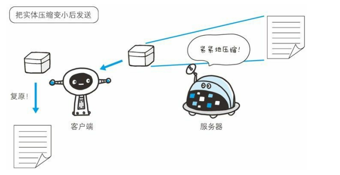

常用的内容编码有以下几种。

- gzip（GNU zip）
- compress（UNIX 系统的标准压缩）
- deflate（zlib）
- identity（不进行编码）

### 分割发送的分块传输编码

在 HTTP 通信过程中，请求的编码实体资源尚未全部传输完成之前，浏览器无法显示请求页面。在传输大容量数据时，通过把数据分割成
多块，能够让浏览器逐步显示页面。

这种把实体主体分块的功能称为分块传输编码（Chunked TransferCoding）。

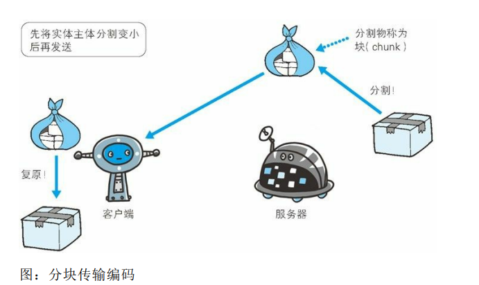

分块传输编码会将实体主体分成多个部分（块）。每一块都会用十六进制来标记块的大小，而实体主体的最后一块会使用“0(CR+LF)”来标
记。

使用分块传输编码的实体主体会由接收的客户端负责解码，恢复到编码前的实体主体。

HTTP/1.1 中存在一种称为传输编码（Transfer Coding）的机制，它可以在通信时按某种编码方式传输，但只定义作用于分块传输编码中。

### 发送多种数据的多部分对象集合

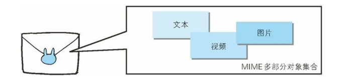

HTTP 协议中也采纳了多部分对象集合，发送的一份报文主体内可含有多类型实体。通常是在图片或文本文件等上传时使用。

- multipart/form-data

    在 Web 表单文件上传时使用。

- multipart/byteranges
    
    状态码 206（Partial Content，部分内容）响应报文包含了多个范
围的内容时使用。

- multipart/form-data

    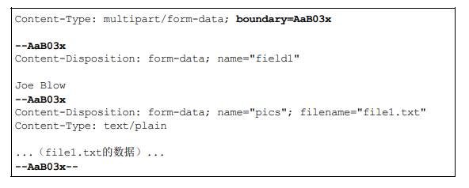

- multipart/byteranges

    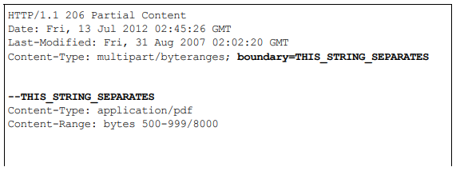
    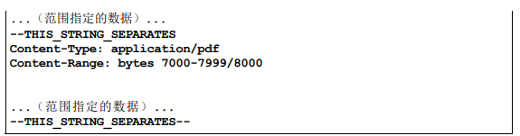

在 HTTP 报文中使用多部分对象集合时，需要在首部字段里加上 ** Content-type** 。

## 获取部分内容的范围请求

以前，用户不能使用现在这种高速的带宽访问互联网，当时，下载一个尺寸稍大的图片或文件就已经很吃力了。如果下载过程中遇到网络
中断的情况，那就必须重头开始。为了解决上述问题，需要一种可恢复的机制。所谓恢复是指能从之前下载中断处恢复下载。

要实现该功能需要指定下载的实体范围。像这样，指定范围发送的请求叫做范围请求（Range Request）。

对一份 10 000 字节大小的资源，如果使用范围请求，可以只请求
5001~10 000 字节内的资源。

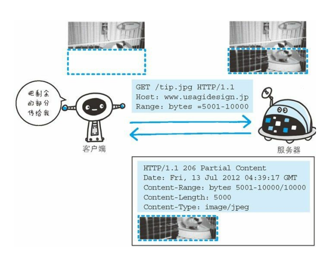

执行范围请求时，会用到首部字段 Range 来指定资源的 byte 范围。byte 范围的指定形式如下。

- 5001~10 000 字节

    `Range: bytes=5001-10000`

- 从 5001 字节之后全部的

    `Range: bytes=5001-`

- 从一开始到 3000 字节和 5000~7000 字节的多重范围
    
    `Range: bytes=-3000, 5000-7000`

针对范围请求，响应会返回状态码为 206 Partial Content 的响应报文。另外，对于多重范围的范围请求，响应会在首部字段 ContentType 标明 multipart/byteranges 后返回响应报文。

如果服务器端无法响应范围请求，则会返回状态码 200 OK 和完整的实体内容。

# HTTP 首部

## HTTP 首部字段

### HTTP 首部字段传递重要信息

使用首部字段是为了给浏览器和服务器提供报文主体大小、所使用的语言、认证信息等内容。

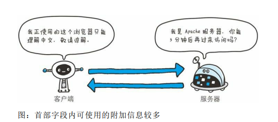

## HTTP/1.1 通用首部字段

### Cache-Control

`Cache-Control: private, max-age=0, no-cache`

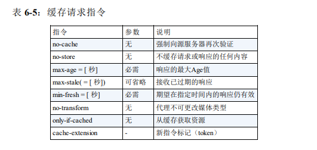

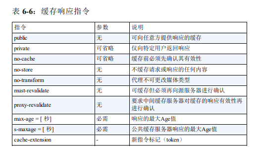

#### no-cache 指令

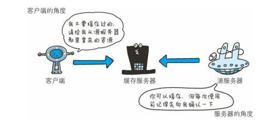

`Cache-Control: no-cache`

使用 no-cache 指令的目的是为了防止从缓存中返回过期的资源。

客户端发送的请求中如果包含 no-cache 指令，则表示客户端将不会接收缓存过的响应。于是，“中间”的缓存服务器必须把客户端请求转发给源服务器。

如果服务器返回的响应中包含 no-cache 指令，那么缓存服务器不能对资源进行缓存。源服务器以后也将不再对缓存服务器请求中提出的资源有效性进行确认，且禁止其对响应资源进行缓存操作。

`Cache-Control: no-cache=Location`

由服务器返回的响应中，若报文首部字段 Cache-Control 中对 no-cache 字段名具体指定参数值，那么客户端在接收到这个被指定参数值的首部字段对应的响应报文后，就不能使用缓存。换言之，无参数值的首部字段可以使用缓存。只能在响应指令中指定该参数。

#### 控制可执行缓存的对象的指令

no-store 指令

`Cache-Control: no-store`

当使用 no-store 指令时，暗示请求（和对应的响应）或响应中包含机密信息。

从字面意思上很容易把 no-cache 误解成为不缓存，但事实上 no-cache 代表不缓存过期的资源，缓存会向源服务器进行有效期确认后处理资源，也许称为 do-not-serve-from-cache-without-revalidation 更合适。no-store 才是真正地不进行缓存，请读者注意区别理解。

因此，该指令规定缓存不能在本地存储请求或响应的任一部分。

#### 指定缓存期限和认证的指令

s-maxage 指令

`Cache-Control: s-maxage=604800（单位 ：秒）`

s-maxage 指令的功能和 max-age 指令的相同，它们的不同点是 s-maxage 指令只适用于供多位用户使用的公共缓存服务器(代理服务器)。也就是
说，对于向同一用户重复返回响应的服务器来说，这个指令没有任何作用。

