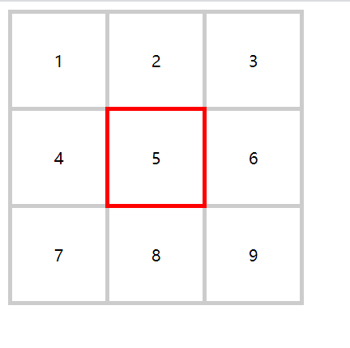

## CSS

### css 单位


#### 解释一下 CSS 里的两个单位：em 和 rem，你一般怎么使用它们？

1em，等于本元素的字体大小，所以在不同的元素里 1em 的绝对大小是不一样的。

而 1rem，等于根元素的字体大小，在一个页面中，无论在哪个元素上 1rem 都是一样的。

em 适合于用在需要大小需要跟随字体变化的属性上，比如 padding、margin、height、width 等等，元素继承了不同的字体大小，这些属性最好也能跟着变化；<br />大多数人可能会认为 em 相对于父元素的字体大小，但是实际上取决于应用在什么 CSS 属性上。对于 font-size 来说，em 相对于父元素的字体大小；line-height 中，em 却相对于自身字体的大小。

rem 适用于字体，这样就可以通过改变根元素的字体大小来改变整个页面的字体大小。

<a name="e27b69d5"></a>

#### px， em， rem 的区别？

- px 是相对长度单位。像素 px 是相对于显示器屏幕分辨率而言的。
- em 是相对长度单位。相对于当前对象内文本的字体尺寸;（参考物是父元素的 font-size）。如当前父元素的字体尺寸未设置，则相对于浏览器的默认字体尺寸
- rem 是相对于 HTML 根元素的字体大小（font-size）来计算的长度单位。

<a name="300d53e9"></a>

#### % 相对于谁

```css
.wp {
  position: relative;
}
.box {
  position: absolute;
  top: 50%;
  left: 50%;
  transform: translate(-50%, -50%);
}
```

- 第一处 50% 是指 .wrap 相对定位元素宽度和高度的 50%，而 `transform` 中的 50% 是指自身元素的宽高的一半。
- 对于设置绝对定位 `position absolute` 的元素，我们可以使用 `left` `right` 表示其偏移量，我们把这个元素的祖先元素中第一个存在定位属性的元素成为参照物元素，其中的 % 是相对于参照物的，`left` 相对于参照物的 `width`，`top` 相对于这个参照物的 `height`。
- 对于设置相对定位 `position relative` 的元素，% 的数值是相对与自身的，left 相对于自己的 width，top 相对于自己的 height。
- 对于设置固定定位 `position fixed` 的元素，% 的数值是相对于视口的，left 相对于视口的 width，top 相对于视口的 height。
- `margin` 和 `padding` 当中的 % 非常特殊，它是相对于父元素的宽度。没错，`margin-top: 30%`，相当于父元素宽度的 30%。
- `font-size` 的 %相对于父元素的字体大小。
- `line-height` 设置行高时，如果单位为 %，则相对于该元素的 `font-size` 数值。
- `text-indent` 这个属性可以设置首行缩进，当使用 % 时，它是相对于父元素的 `width`。
- `border-radius: 50%`得到一个圆形，因此不难发现这里的 % 也是相对于自身宽高的。
- `background-size` 的百分比和 `border-radius` 一样，也是相对于自身的宽高。
- `transform` 的 `translate` 属性 % 是相对于自身的宽高，这也是我们上述代码能够实现居中的原因。

<a name="0189ec93"></a>

### 布局方式

<a name="050aa3e5"></a>

#### 什么是 flex？写出常见属性，以及作用？

flex：弹性布局。

常见属性及作用：

- flex-direction 属性决定主轴的方向（即项目的排列方向）。
- justify-content 属性定义了项目在主轴上的对齐方式。
- align-items 属性定义项目在交叉轴上如何对齐。
- align-content 属性定义了多根轴线的对齐方式。如果项目只有一根轴线，该属性不起作用。

项目属性：

- order 属性定义项目的排列顺序。数值越小，排列越靠前，默认为 0。
- flex 属性是 flex-grow, flex-shrink 和 flex-basis 的简写，默认值为 0 1 auto。后两个属性可选。
- align-self 属性允许单个项目有与其他项目不一样的对齐方式，可覆盖 align-items 属性。

<a name="01fcdfbc"></a>

#### display 有哪些值？说明他们的作用？

- none：   元素不会被显示
- block： 此元素将显示为块级元素，此元素前后会带有换行符。
- inline： 默认。此元素会被显示为内联元素，元素前后没有换行符。
- inline-block： 像行内元素一样显示，但其内容像块类型元素一样显示。可以设置宽高，可以设置 margin 和 padding。
- flex： 弹性盒子布局
- inline-flex：内联的弹性盒子布局
- table： 此元素会作为块级表格来显示（类似 `<table>`），表格前后带有换行符。
- inline-table： 此元素会作为内联表格来显示（类似 `<table>`），表格前后没有换行符。
- table-row： 此元素会作为一个表格行显示（类似 `<tr>`）。
- table-cell：此元素会作为一个表格单元格显示（类似 `<td>` 和 `<th>`）
- grid： 网格布局
- inherit 规定应该从父元素继承 display 属性的值。

<a name="60360866"></a>

#### 隐藏一个元素有多少种方法？

1. `display:none;`
1. `opacity:0;`
1. `visibility：hidden;`
1. `position:absolute;clip(0,0,0,0);`
1. `overflow:hidden;`
1. `width: 0px;height: 0px;`

<a name="bf796caa"></a>

#### `display: none` 与 `visibility: hidden`区别在哪？

联系：它们都能让元素不可见

区别：

1. `display:none`会让元素完全从渲染树中消失，渲染的时候**不占据任何空间**；`visibility: hidden`不会让元素从渲染树消失，渲染元素**继续占据空间**，只是内容不可见
1. `display: none`是**非继承属性**，子孙节点消失由于元素从渲染树消失造成，通过修改子孙节点属性无法显示；`visibility: hidden`**是继承属性**，子孙节点消失由于继承了 hidden，通过设置`visibility: visible`可以让子孙节点显示
1. 修改常规流中元素的`display`通常会造成文档**回流**。修改`visibility`属性只会造成本元素的**重绘**。
1. **读屏器**不会读取`display: none`元素内容；会读取`visibility: hidden`元素内容

<a name="1cfeae1d"></a>

### 浮动

<a name="4dd9fb90"></a>

#### 行内元素`float:left`后是否变为块级元素？

浮动后，行内元素不会成为块状元素，但是可以设置宽高。行内元素要想变成块状元素，占一行，直接设置`display:block`。但如果元素设置了浮动后再设置`display:block`那就不会占一行

<a name="b0e5cdc7"></a>

#### 为什么要清除浮动？

不清除浮动会发生高度塌陷：<br />父元素不写高度时，子元素写了浮动后，父元素会发生高度塌陷。

<a name="386ffb30"></a>

#### 清除浮动有几种方式？

1.  添加空 div，在浮动元素下方添加空 div，并给该元素写 CSS 样式`clear:both`

- 优点： 简单，代码少，浏览器支持好，不容易出现怪问题
- 缺点： 页面浮动布局多，就要增加很多空 div

2.  父级设置高度

- 优点：简单，代码少
- 缺点： 只适合高度固定的布局

3.  父级同时浮动（需要给父级同级元素添加浮动）

- 优点： 无
- 缺点： 产生新的浮动问题

4.  给父级添加`overflow:hidden` 清除浮动方法

- 优点： 简单，代码少，浏览器支持好
- 缺点： 不能和 position 配合使用，因为超出的尺寸的会被隐藏

5.  父级元素定义 after 伪类 （现在主流方法，推荐使用）

- 优点： 浏览器支持好，不容易出现怪问题
- 缺点： 代码多

```css
.fix:after {
  content: "";
  display: table;
  clear: both;
}
//兼容ie6,7
.fix {
  *zoom: 1;
}
```

<a name="43aaad33"></a>

### CSS 盒模型

<a name="8b07078c"></a>

#### 介绍一下标准的 CSS 的盒子模型？低版本 IE 的盒子模型有什么不同的？

- 标准模型`width`不计算`padding`和`border`
- IE 模型`width`计算`padding`和`border`。

`box-sizing` : `content-box`(标准模型-默认)/`border-box`(IE 模型)

<a name="57f520c9"></a>

#### js 中如何获取盒模型宽高?

1.  `dom.style.width`（只能取内联宽高)
1.  `dom.currentStyle.width` (浏览器渲染之后的取值，只有 IE 支持)
1.  `window.getComputedStyle(dom).width` (浏览器渲染之后的取值，兼容性更好)
1.  `dom.getBoundingClientRect().width/height/left/top` (常用于计算位置)

<a name="BFC"></a>

### BFC

<a name="5c94b96b"></a>

#### 什么是 BFC?(概念)

块级格式化上下文

<a name="7a381f31"></a>

#### 对 BFC 规范的理解？

它决定了元素如何对其内容进行定位，以及与其他元素的关系和相互作用

<a name="afa22aba"></a>

#### BFC 的原理？

1.  同一 BFC 内块级元素之间的垂直方向边距会发生重叠。
1.  浮动元素区域不会与 BFC 重叠
1.  BFC 在页面上是一个独立的容器，外面的元素不会影响里面的元素，里面的元素也不会影响外面的元素
1.  计算 BFC 高度时，浮动元素也会参与计算

<a name="fa5cde04"></a>

#### 如何创建 BFC？

- `<html>` 根元素。
- `float` 的值不为 `none` 。
- `overflow` 值不为 `visible` 的块元素。
- 绝对定位元素（元素的 `position` 为 `absolute` 或 `fixed`）
- `display` 的值为 `table-cell`、 `table-caption` 和 `inline-block` 中的任何一个。

<a name="3cd17cfc"></a>

#### BFC 使用场景?

1.  解决垂直方向的边距重叠
1.  清除浮动

<a name="65b4304e"></a>

### 重绘（Repaint）和回流（Reflow）

重绘和回流会在我们设置节点样式时频繁出现，同时也会很大程度上影响性能。

<a name="5ae82b20"></a>

#### 重绘与回流

- 重绘(Repaint)是当节点需要更改外观而不会影响布局的，比如改变 `color` 就叫称为重绘
- 回流(Reflow)是布局或者几何属性需要改变就称为回流。

回流必定会发生重绘，重绘不一定会引发回流。回流所需的成本比重绘高的多，改变父节点里的子节点很可能会导致父节点的一系列回流。

**以下几个动作可能会导致性能问题：**

- 改变 `window` 大小
- 改变字体
- 添加或删除样式
- 文字改变
- 定位或者浮动
- 盒模型

并且很多人不知道的是，重绘和回流其实也和 Eventloop 有关。

1. 当 Eventloop 执行完 Microtasks（微任务） 后，会判断 `document` 是否需要更新，因为浏览器是 60Hz 的刷新率，每 16.6ms 才会更新一次。
1. 然后判断是否有 `resize` 或者 `scroll` 事件，有的话会去触发事件，所以 `resize` 和 `scroll` 事件也是至少 16ms 才会触发一次，并且自带节流功能。
1. 判断是否触发了 media query(媒体查询)
1. 更新动画并且发送事件
1. 判断是否有全屏操作事件
1. 执行 `requestAnimationFrame` 回调
1. 执行 `IntersectionObserver` 回调，该方法用于判断元素是否可见，可以用于懒加载上，但是兼容性不好
1. 更新界面
1. 以上就是一帧中可能会做的事情。如果在一帧中有空闲时间，就会去执行 `requestIdleCallback` 回调。

以上内容来自于 [HTML 文档](https://html.spec.whatwg.org/multipage/webappapis.html#event-loop-processing-model)。

<a name="d021a99d"></a>

#### 减少 重绘与回流

1. 使用 `transform` 替代 `top`
1. 使用 `visibility` 替换 `display: none` (前者只会引起重绘，后者会引发回流)
1. 不要把节点的属性值放在一个循环里当成循环里的变量

```javascript
for (let i = 0; i < 1000; i++) {
  // 获取 offsetTop 会导致回流，因为需要去获取正确的值
  console.log(document.querySelector(".test").style.offsetTop);
}
```

4. 不要使用 `table` 布局，可能很小的一个小改动会造成整个 `table` 的重新布局
5. 动画实现的速度的选择，动画速度越快，回流次数越多，可以选择使用 `requestAnimationFrame`
6. CSS 选择符**从右往左**匹配查找，避免节点层级过多
7. 将频繁重绘或者回流的节点设置为图层，图层能够阻止该节点的渲染行为影响别的节点。比如对于 `video` 标签来说，浏览器会自动将该节点变为图层;<br />以下常用属性可以生成新图层:
   - `will-change`
   - `video、iframe` 标签
8. 不要重复添加 DOM， 如果有多个操作合并在一起添加到页面

<a name="FOUC"></a>

### FOUC

<a name="bbc70c88"></a>

#### 什么是 FOUC?如何避免?

`Flash Of Unstyled Content`：用户定义样式表加载之前浏览器使用默认样式显示文档，CSS 样式加载后再次渲染文档，造成页面闪烁。

解决方法：把样式表放到文档的 head

<a name="1489fbbf"></a>

### css sprite

<a name="0cb1614d"></a>

#### css sprite 是什么,有什么优缺点

概念：将多个小图片拼接到一个图片中。通过`background-position`和元素尺寸调节显示需要的背景图案。

优点：

- 减少 HTTP 请求数，提高页面加载速度
- 减少图片大小
- 更换风格方便，只需在一张或几张图片上修改颜色或样式即可实现

缺点：

- 图片合并麻烦
- 维护麻烦，修改一个图片可能需要从新布局整个图片，样式

<a name="CSS3"></a>

#### CSS3

<a name="e8e31572"></a>

#### CSS3 有哪些新特性

- 新增各种 CSS 选择器
- 边框圆角 `border-radius`
- 多列布局
- 阴影和反射
- 文字特效`text-shadow`
- 线性渐变
- 旋转`transform`
- 过渡`transition`
- 动画`animation`

<a name="85dc4a93"></a>

#### CSS3 新增伪类有那些？

```css
* p:first-of-type 选择属于其父元素的首个<p>元素的每个<p> 元素。
* p:last-of-type 选择属于其父元素的最后 <p> 元素的每个<p> 元素。
* p:only-of-type 选择属于其父元素唯一的 <p>元素的每个 <p> 元素。
* p:only-child 选择属于其父元素的唯一子元素的每个 <p> 元素。
* p:nth-child(2) 选择属于其父元素的第二个子元素的每个 <p> 元素。
* :before 在元素之前添加内容
* :after 在元素之后添加内容,也可以用来做清除浮动。
* :enabled 选择器匹配每个启用的的元素（主要用于表单元素）。
* :disabled 控制表单控件的禁用状态。
* :checked 单选框或复选框被选中
```

<a name="3b66e969"></a>

### 笔试题

<a name="8bb8804f"></a>

#### 如何用 css 实现一行文字后面...的情况?

```css
overflow: hidden; //超出隐藏
white-space: nowrap; //不允许换行
text-overflow: ellipsis; //超出部分用...代替
//多行的情况请添加如下设置
display: -webkit-box;
-webkit-line-clamp: 1; //多行情况下可以设置哪一行多余部分用...代替。这里设置的是第一行
-webkit-box-orient: vertical;
```

<a name="92317a85"></a>

#### css3 如何实现 0.5px 的细线?

```css
.line {
  position: relative;
}
.line:after {
  content: "";
  position: absolute;
  left: 0;
  top: 0;
  width: 100%;
  height: 1px;
  background-color: #000000;
  -webkit-transform: scaleY(0.5);
  transform: scaleY(0.5); //在Y轴缩小一半
}
```

```html
<div class="line"></div>
```

<a name="a0fe8230"></a>

#### css 如何实现三角形?

```css
span {
  border-top: 40px solid transparent;
  border-left: 40px solid transparent;
  border-right: 40px solid transparent;
  border-bottom: 40px solid #ff0000;
}
```

<a name="bd37de4e"></a>

#### 宽高已知，如何实现 div 水平垂直居中?

<a name="f58ce33d"></a>

##### 第一种方案

```css
.box {
  width: 400px;
  height: 200px;
  position: relative;
  background: red;
}
.content {
  width: 200px;
  height: 100px;
  position: absolute;
  top: 50%;
  left: 50%;
  margin-left: -100px;
  margin-top: -50px;
  background: green;
}
```

<a name="8de187bb"></a>

##### 第二种方案

```css
.box {
  height: 200px;
  position: relative;
  background: red;
}
.box div {
  position: absolute;
  top: 0;
  left: 0;
  right: 0;
  bottom: 0;
  width: 100px;
  height: 100px;
  margin: auto;
  background: green;
}
```

```html
<div class="box">
  <div class="content">水平垂直居中</div>
</div>
```

<a name="4bf0d1a9"></a>

#### 宽高未知，如何实现 div 水平垂直居中?

<a name="f58ce33d-1"></a>

##### 第一种方案

```css
.box {
  width: 400px;
  height: 200px;
  position: relative;
  background: red;
}
.content {
  position: absolute;
  top: 50%;
  left: 50%;
  transform: translate(-50%, -50%);
  background: green;
}
```

<a name="f84c0f0d"></a>

##### flex 解决方案:

```css
.box {
  width: 400px;
  height: 200px;
  background: red;
  display: flex;
  justify-content: center;
  align-items: center;
}
.content {
  width: 200px;
  height: 100px;
  background: green;
}
```

<a name="c9fe74cb"></a>

#### 假设高度已知，请写出三栏布局(圣杯布局)，其中左栏、右栏宽度各为 100px，中间自适应

以下布局如果条件是高度未知,依然适用的布局有 flex, table 布局。

- 浮动:
  - 缺点：脱离文档流，需清除浮动。处理不好会带来很多问题。
  - 优点：兼容性好。

```css
<style>
    .box1 div{
      min-height: 50px;
    }
    .box1 .left{
        float: left;
        width: 100px;
        background: red;
    }
    .box1 .right{
        float: right;
        width: 100px;
        background: green;
    }
    .box1 .center{
        background: yellow;
        margin: 0 100px;
    }
</style>
<section class="box1">
    <div class="left"></div>
    <div class="right"></div>
    <div class="center">浮动自适应部分</div>
</section>
```

- 绝对定位:
  - 缺点：绝对定位脱离文档流，导致了其子元素都脱离了文档流，可使用性很差。
  - 优点：快捷！

```css
<style>
    .box2{
        min-height: 50px;
    }
    .box2 div{
        position: absolute;
        min-height: 50px;
    }
    .box2 .left{
        width: 100px;
        left: 0;
        background: red;
    }
    .box2 .center{
        left: 100px;
        right: 100px;
        background: yellow;
    }
    .box2 .right{
        right: 0;
        width: 100px;
        background: green;
    }
</style>
<section class="box2">
    <div class="left"> </div>
    <div class="center">绝对定位自适应部分</div>
    <div class="right"></div>
</section>
```

- flex:
  - 缺点：只兼容到 ie9。
  - 优点：比较完美的方案。

```css
<style>
    .box3{
        display: flex;
        min-height: 50px;
    }
    .box3 .left{
        width: 100px;
        background: red;
    }
    .box3 .center{
        flex: 1;
        background: yellow;
    }
    .box3 .right{
        width: 100px;
        background: green;
    }

</style>
<section class="box3">
    <div class="left"></div>
    <div class="center">flex自适应部分</div>
    <div class="right"></div>
</section>
```

- 表格:
  - 缺点：多栏布局时，某个单元格高度超出，会使其他单元格高度一起增加。操作繁琐，SEO 不友好。
  - 优点：兼容性好，兼容 ie8。

```css
<style>
    .box4 {
        display: table;
        width: 100%;
        min-height: 50px;
    }
    .box4 div{
        display: table-cell;
    }
    .box4 .left{
        width: 100px;
        min-height: 50px;
        background: red;
    }
    .box4 .center{
        min-height: 50px;
        background: yellow;
    }
    .box4 .right{
        width: 100px;
        min-height: 50px;
        background: green;
    }
</style>
<section class="box4">
    <div class="left"></div>
    <div class="center">表格自适应部分</div>
    <div class="right"></div>
</section>
```

- 网格布局:
  - 优点:新技术，代码量少
  - 缺点:兼容性不好， 不兼容 IE

```css
<style>
    .box5{
        display: grid;
        width: 100%;
        grid-template-rows:50px;
        grid-template-columns:100px auto  100px;
    }
    .box5 .left{
        background: red;
    }
    .box5 .center{
        background: yellow;
    }
    .box5 .right{
        background: green;
    }
</style>
<section class="box5">
    <div class="left"></div>
    <div class="center">网格自适应部分</div>
    <div class="right"></div>
</section>
```

<a name="67cfef37"></a>

#### 如何实现下图九宫格的效果?鼠标滑过边框显示红色?



```css
.wrap {
  display: flex;
  flex-wrap: wrap;
  width: 300px;
}

.wrap li {
  display: inline-flex;
  width: 100px;
  height: 100px;
  justify-content: center;
  align-items: center;
  border: 4px solid #ccc;
  box-sizing: border-box;
  margin-left: -4px;
  margin-top: -4px;
}

.wrap li:nth-child(3n + 1) {
  margin-left: 0;
}

.wrap li:nth-child(1),
.wrap li:nth-child(2),
.wrap li:nth-child(3) {
  margin-top: 0;
}

.wrap li:hover {
  border-color: red;
  z-index: 1;
}
```

---
