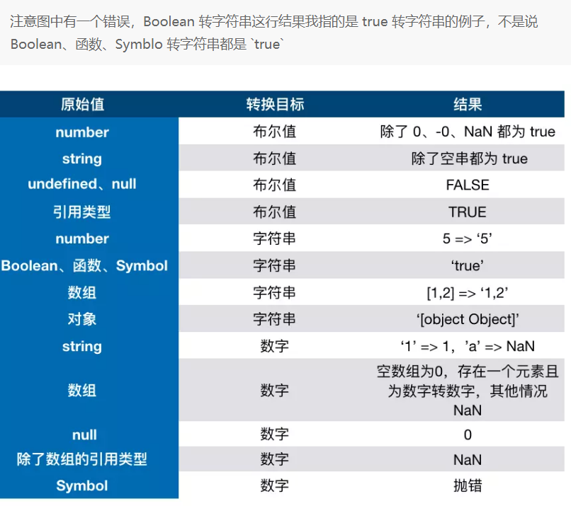
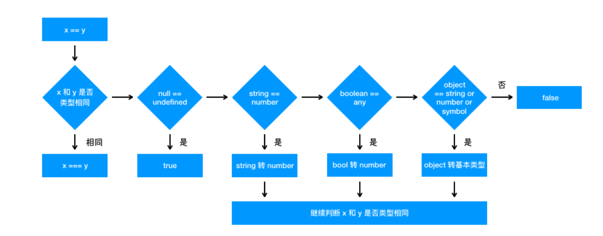
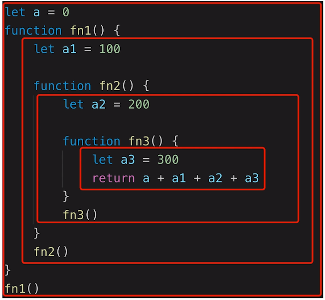
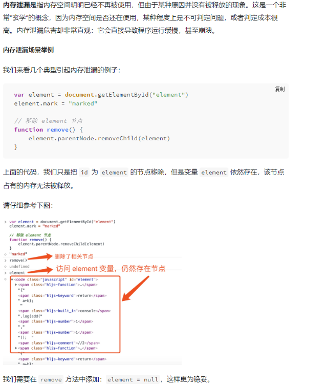
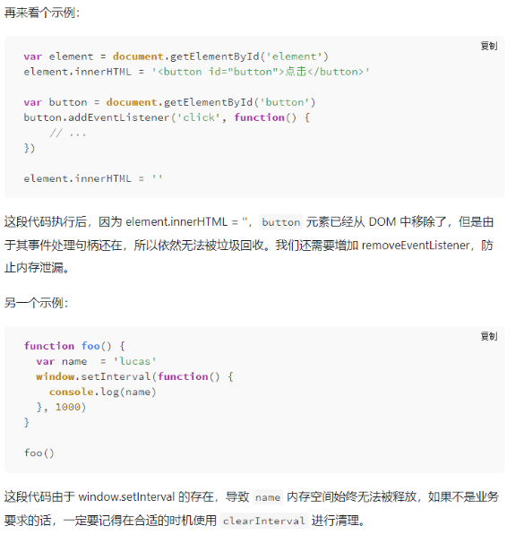
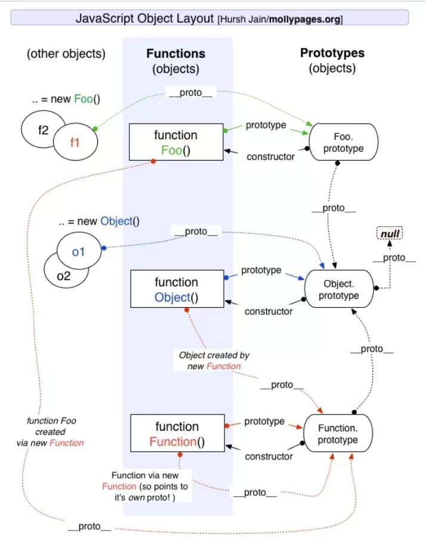
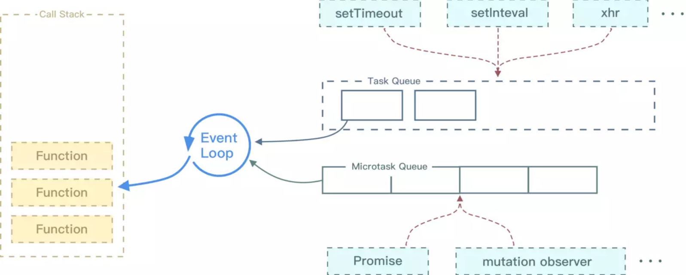

## JS

<a name="dcc5da07"></a>

### JS 规范

<a name="0c505d05"></a>

#### 说几条写 JavaScript 的基本规范？

- 不要在同一行声明多个变量
- 请使用`===/!==`来比较`true/false`或者数值
- 使用对象字面量替代`new Array`这种形式
- 不要使用全局函数
- `Switch`语句必须带有`default`分支
- `If`语句必须使用大括号
- `for-in`循环中的变量 应该使用`let`关键字明确限定作用域，从而避免作用域污染

<a name="5f1fdeb8"></a>

#### W3C 对 JS 的规定有哪些?

- DOM
- BOM
- 事件绑定
- ajax 请求(包括 http 协议)
- 存储

<a name="52cbb596"></a>

### 变量类型

<a name="48337bea"></a>

#### 原始类型有哪些？

字符串（`String`）、数值（`Number`）、布尔值（`Boolean`）、`Undefined`、`Null`、 `symbol`

占用空间固定，保存在栈中，存储的是值。

原始类型存储的是值，是没有函数可以调用的。之所以 `'1'.toString()` 可以被调用，是因为它做了一层封装。被强制转换成了 `String` 类型，也就是对象类型,   所以可以调用`toString`函数。

`string` 类型是不可变的，无论你在 `string` 类型上调用何种方法，都不会对值有改变。

<a name="d8bf65cc"></a>

#### 对象类型有哪些？

对象（`Object`）、数组（`Array`）、函数（`Function`）

占用空间不固定，地址存在栈内存，值保存在堆中, 复制的是地址, 指向同一块内存空间。 使用 `instanceof` 检测数据类型

<a name="33fb3603"></a>

#### 为什么值类型赋值是直接赋值， 而引用类型是直接赋值一个内存地址？

主要考虑到性能/存储问题，因为值类型占用空间比较少。它可以直接赋值， 不会对性能造成太大影响。而一般来说， 引用类型存储的空间占用较大，不好管理。如果我们直接复制会导致复制过程非常慢。所以说， 计算机所有的程序，所有的代码，所有的语言，都是采用这种方式。

<a name="0132ee15"></a>

#### 原始类型和对象类型区别?

1. 原始类型存储的是值,保留在栈内存(空间固定)，相等都要重新创建一份
1. 对象类型存储的是指针，保留在堆内存(空间不固定)，相等时引用的是同一份指针

<a name="759165a7"></a>

#### typeof 都能识别哪些类型？

- 识别除了`null`之外的所有值类型
- 识别函数
- 判断是否是引用类型（不可再细分）

<a name="58675477"></a>

#### 类数组和数组的区别是什么？

类数组: 拥有 length 属性，不具有数组所具有的方法。

<a name="36cb2319"></a>

#### 类数组如何转换为数组？

```javascript
//第一种方法
Array.prototype.slice.call(arrayLike);
//第二种方法
[...arrayLike];
//第三种方法:
Array.from(arrayLike);
```

<a name="0ea44aee"></a>

#### JS 内置函数是什么?

内置函数: `Object`, `Array` , `Function` , `Boolean` , `Number` , `String` , `Date` , `RegExp` , `Error` , `Json` .

作用: 作为构造器函数

<a name="4c7845ba"></a>

#### 函数参数是对象会发生什么?

函数参数是对象指针的副本，当参数重新分配对象时，参数的指针会发生变化。两个变量的值也会不相同

<a name="de4706ae"></a>

#### null 和 undefined 的区别是什么?

- `null`表示空对象指针
  - 如果定义的变量准备用来保存对象，那么最好初始化为`null`
- `undefined`表示未赋值的变量
- 在使用`==`会发生类型转换.导致相等

<a name="3b507f41"></a>

#### null 是对象嘛？

null 并不是对象类型 。虽然 typeof null 会输出 object，但是这只是 JS 存在的一个悠久 Bug。在 JS 的最初版本中使用的是 32 位系统，为了性能考虑使用低位存储变量的类型信息，000 开头代表是对象，然而 null 表示为全零，所以将它错误的判断为 object 。虽然现在的内部类型判断代码已经改变了，但是对于这个 Bug 却是一直流传下来。

<a name="0ddaf0b7"></a>

#### instanceof 的原理:

沿着原型链一层一层向上找, 看是否能找到对应的`prototype`

<a name="3b4d6238"></a>

#### 自己实现一个 instanceof

```javascript
function myInstanceof(left, right) {
  let prototype = right.prototype;
  left = left.__proto__;
  while (true) {
    if (left === null || left === undefined) return false;
    if (prototype === left) return true;
    left = left.__proto__;
  }
}
```

<a name="edb70eef"></a>

#### 怎么实现浅拷贝？

浅拷贝是指只拷贝所有属性到新对象,如果属性值是对象,只拷贝地址.

浅拷贝通过`object.assign()`,扩展运算符`...`来解决

```javascript
var newObj = Object.assign({}, obj);
var newObj = { ...obj };
```

<a name="f746531e"></a>

#### 怎么实现深拷贝？

- 通过 JSON.parse(JSON.stringify(object)) 来解决

```javascript
var newObj = JSON.parse(JSON.stringify(obj));
```

但是：会忽略 `undefined`、 `symbol`、不能序列化函数、不能解决循环引用的对象

<a name="f3c723ec"></a>

### 类型转换

<a name="79a9c4fe"></a>

#### 哪些情况下会发生类型转换?

- ==
- 逻辑运算符
- if
- 字符串拼接

首先我们要知道，在 JS 中类型转换只有三种情况，分别是：

- 转换为布尔值
- 转换为数字
- 转换为字符串

**类型转换表格**



<a name="352035bd"></a>

#### 转 Boolean

在条件判断时，除了 `undefined`，`null`， `false`，`NaN`， `''`， `0`， `-0`，其他所有值都转为 `true`，包括所有对象。

<a name="d7b6bb49"></a>

#### JavaScript 中如何进行隐式类型转换？

首先要介绍 `ToPrimitive` 方法，这是 JavaScript 中每个值隐含的自带的方法，用来将值 （无论是基本类型值还是对象）转换为基本类型值。如果值为基本类型，则直接返回值本身；如果值为对象，其看起来大概是这样：

```javascript
/**
 * @obj 需要转换的对象
 * @type 期望的结果类型
 */
ToPrimitive(obj, type);
```

<a name="43597289"></a>

##### `type` 的值为 `number` 或者 `string`。

当 `type` 为 `number` 时规则如下：

1. 调用 `obj` 的 `valueOf` 方法，如果为原始值，则返回，否则下一步；
1. 调用 `obj` 的 `toString` 方法，后续同上；
1. 抛出 `TypeError` 异常

<a name="b50e8d3f"></a>

##### 当 `type` 为 `string` 时规则如下：

1. 调用 `obj` 的 `toString` 方法，如果为原始值，则返回，否则下一步；
1. 调用 `obj` 的 `valueOf` 方法，后续同上；
1. 抛出 `TypeError` 异常。

可以看出两者的主要区别在于调用 `toString` 和 `valueOf` 的先后顺序。默认情况下：

1. 如果对象为 `Date` 对象，则 `type` 默认为 `string`；
1. 其他情况下，`type` 默认为 `number`。

而 JavaScript 中的隐式类型转换主要发生在 `+、-、*、/` 以及 `==、>、<` 这些运算符之间。而这些运算符只能操作基本类型值，所以在进行这些运算前的第一步就是将两边的值用 `ToPrimitive` 转换成基本类型，再进行操作。

<a name="03ceb764"></a>

#### 四则运算符

加法运算符不同于其他几个运算符，它有以下几个特点：

- 运算中其中一方为字符串，那么就会把另一方也转换为字符串
- 如果一方不是字符串或者数字，那么会将它转换为数字或者字符串

```javascript
1 + "1"; // '11'
true + true; // 2
4 + [1, 2, 3]; // "41,2,3"
```

如果你对于答案有疑问的话，请看解析：

- 对于第一行代码来说，触发特点一，所以将数字 1 转换为字符串，得到结果 '11'
- 对于第二行代码来说，触发特点二，所以将 true 转为数字 1
- 对于第三行代码来说，触发特点二，所以将数组通过 toString 转为字符串 1,2,3，得到结果 41,2,3

另外对于加法还需要注意这个表达式 'a' + + 'b'

`'a' + + 'b' // -> "aNaN"`

因为`+ 'b'` 等于 `NaN`，所以结果为 `"aNaN"`，你可能也会在一些代码中看到过 `+ '1'` 的形式来快速获取 number 类型。

除了加法运算，只要其中一方为数字，另一方必定转为数字。

```javascript
4 * "3"; // 12
4 * []; // 0
4 * [1, 2]; // NaN
```

<a name="d52f2cb3"></a>

#### 比较运算符

1. 如果是对象，就通过 toPrimitive 转换对象
1. 如果是字符串，就通过 unicode 字符索引来比较

```javascript
let a = {
  valueOf() {
    return 0;
  },
  toString() {
    return "1";
  },
};
a > -1; // true
```

在以上代码中，因为`a`是对象，所以会通过 `valueOf` 转换为原始类型再比较值。

<a name="f696adfc"></a>

#### == 和 === 有什么区别？

首先使用 `==` 是会发生隐式类型转换的。 一般只有判断一个变量是不是`null`和`undefined`时会使用`==`。其它地方一律用`===`。

`==`运算流程图



<a name="JSON"></a>

### JSON

<a name="1d650912"></a>

#### 怎么理解 json?

是内置的 js 对象,也是一种数据格式

它有两个方法:

```javascript
JSON.stringify({ a: 10, b: 11 }); //把对象变成字符串

JSON.parse("{a:10,b:11}"); //把字符串变成对象
```

<a name="716a9f2d"></a>

#### XML 与 JSON 的区别?

JSON 数据体积小 , 传递快 , 与 JavaScript 交互更加方便 , 容易解析 。

但是数据描述性差 , 不如 XML

<a name="DOM"></a>

### DOM

<a name="a2492e03"></a>

#### DOM 的本质?

> <br />DOM: Document Object Model 文档对象模型。
>
> HTML 代码就是一个字符串，但是浏览器已经把字符串结构化成树形结构了。

DOM 本质就是浏览器拿到 HTML 代码后，DOM 把 HTML 代码结构化成浏览器及 JS 可识别的模型 。

<a name="eeb589aa"></a>

#### DOM 是哪种数据结构?

它是从 HTML 文件解译出来的一棵 DOM **树形结构**。

<a name="1c3a2d05"></a>

#### DOM 结构操作有哪些？

- 新增节点 `document.createElement(node)`
- 获取父元素 `childNode.parentElement`
- 获取子元素 `parentNode.childNodes`
- 删除节点 `parentNode.removeChild(childNode)`

<a name="6b91c283"></a>

#### childNodes 和 children 的区别?

`childNodes` 属性返回所有的节点，包括文本节点、注释节点；<br />`children` 属性只返回元素节点；

<a name="d05d1b08"></a>

#### Attribute 和 property 有何区别?

- `attribute` (自定义)属性在 HTML 上设置修改， 会直接反应到 HTML 上， 两者同步。
- `porperty` (固有)属性可以看做是 DOM 对象的键值对， 用点操作符对他们进行操作。 实际编程中， 基本的 DOM 操作都是使用 `peoperty` 的点操作符。
- 对于 HTML 的标准属性来说，`attribute`和`property`是同步的，是会自动更新的
- 对于自定义的属性来说，它们是不同步的

<a name="b7b8d094"></a>

#### offsetWidth/offsetHeight,clientWidth/clientHeight 与 scrollWidth/scrollHeight 的区别?

- `offsetWidth/offsetHeight`返回值包含`content` + `padding` + `border`
- `clientWidth/clientHeight`返回值只包含`content` + `padding`
- `scrollWidth/scrollHeight`返回值包含`content`+ `padding` + 溢出内容的尺寸

<a name="16bf4d7d"></a>

### 作用域和闭包

<a name="f8603930"></a>

#### 作用域是什么？

**一个函数的父级作用域是在它定义的时候的作用域，而非它执行时候的作用域。**

作用域其实就是代表了一个变量合法的使用范围。如果超出了范围就会报错。

作用域分为局部作用域和全局作用域，处在局部作用域里面可以访问到全局作用域的变量，而在局部作用域外面就访问不到局部作用域里面所声明的变量。



<a name="f1902461"></a>

#### 作用域链是什么?

在局部作用域访问变量 , 如果访问不到 , 自由变量会一直向父级作用域寻找，这样的链条称之为作用域链。

<a name="0559e110"></a>

#### 自由变量是什么？

- 一个变量在当前作用域没有定义， 但被使用了。
- 向上级作用域， 一层一层依次寻找， 直到找到为止。
- 如果到全局作用域都没找到， 则报错 `xx is not defined`

<a name="8c8b54d1"></a>

#### 什么是闭包呢?

闭包的定义其实很简单：函数 A 内部有一个函数 B，函数 B 可以访问到函数 A 中的变量，那么函数 B 就是闭包。

```javascript
function A() {
  let a = 1;
  window.B = function () {
    console.log(a);
  };
}
A();
B(); // 1
```

在 JS 中，**闭包存在的意义就是让我们可以间接访问函数内部的变量。**

两道考题：

```javascript
function create() {
  const a = 100;
  return function () {
    console.log(a);
  };
}

const fn = create();
const a = 200;
fn(); //100
```

```javascript
function print(fn) {
  const a = 200;
  fn();
}
const a = 100;
function fn() {
  console.log(a);
}
print(fn); //100
```

无论出什么样的考题， 我们都一定要记住！

**所有的自由变量的查找， 是在函数定义的地方向上级作用域查找， 而不是在执行的地方！！！**

<a name="97368ffa"></a>

#### 闭包有哪些优点和缺点?

优点: 封装性强，使得变量始终保持在内存中。

缺点: 内存的消耗导致的性能问题（不用的闭包设置为`null`清除闭包）

<a name="b63640bf"></a>

#### 闭包使用场景?

使用场景:

- 函数作为**返回值**
- 函数作为**参数**传递

<a name="d1d8fad2"></a>

#### 循环中使用闭包解决 var 定义函数的问题?

- 闭包解决方案

```javascript
for (var i = 1; i <= 5; i++) {
  (function (j) {
    setTimeout(function timer() {
      console.log(j);
    }, j * 1000);
  })(i);
}
```

- 使用 setTimeout 的第三个参数

```javascript
for (var i = 1; i <= 5; i++) {
  setTimeout(
    function timer(j) {
      console.log(j);
    },
    i * 1000,
    i
  );
}
```

- let 解决方案（推荐）

```javascript
for (let i = 1; i <= 5; i++) {
  setTimeout(function timer() {
    console.log(i);
  }, i * 1000);
}
```

<a name="53e3ff7f"></a>

#### 实际开发中闭包的应用有哪些？

- 隐藏数据， 只提供 API
- 做一个简单的 cache 工具

```javascript
//闭包隐藏数据，只提供API
function createCache() {
  const data = {}; //闭包中的数据被隐藏， 不被外界访问
  return {
    set: function (key, val) {
      data[key] = val;
    },
    get: function (key) {
      return data[key];
    },
  };
}

const c = createCache();
c.set("a", 100);
console.log(c.get("a")); //100
```

<a name="lzo8i"></a>

#### 内存泄漏




<a name="8da93974"></a>

### this 全解析

> this 取值是在执行的时候确认的， 而不是在定义的时候。

<a name="JiC4B"></a>

####

<a name="49464210"></a>

#### this 有哪几种调用方式？

- 作为普通函数
- 作为 `call, apply, bind`
- 作为对象方法调用
- 在 class 方法中调用
- 箭头函数

<a name="f96bd6fd"></a>

#### this 有哪些使用场景?

1. 作为对象属性执行
1. 作为构造函数执行
1. 作为普通函数执行
1. `call apply bind`

<a name="94f53ba6"></a>

#### this 指向如何判断?

- 函数直接调用指向`window`
- 对象调用,`this`指向调用的对象
- `new`方式直接指向它的实例对象
- 箭头函数无`this`,取决于上下文的`this`
- `bind`的`this`永远指向第一次指定的对象

<a name="42a1b3ae"></a>

#### this 优先级

1. `new`优先级最高
1. `bind`次之
1. 然后是`obj.foo()`对象调用
1. 最后是`foo（）`直接调用，同时箭头函数 `this`一旦绑定，不会再改变

<a name="77cdfb71"></a>

#### 以下代码 this 指向谁？

```javascript
<div class="table" onclick="callback()"></div>;

function callback() {
  console.log(this);
}
```

这个调用场景适用于将函数用作独立函数调用，`callback` 中的 `this` 在非严格模式下指向 `windows`，严格模式下指向`undefined`。

如果想要打印当前元素,需要在调用 `callback(this)` 时添加上 `this` 参数。

<a name="89dd8547"></a>

#### 写出打印结果，并解释为什么？

1. <br />

```javascript
let length = 10;
function fn() {
  console.log(this.length);
}
var obj = {
  length: 5,
  method: function (fn) {
    fn();
    arguments[0]();
  },
};
obj.method(fn, "l");
```

第一次打印 1， 此时 `this` 指向 `window` , `window.length` 指的是 `frame` `iframe`的窗口数量。

第二次打印 2， 此时 `this` 指向 `arguments` 对象。 此时 `arguments` 参数长度是 2。

2. <br />

```javascript
const o1 = {
  text: "o1",
  fn: function () {
    return this.text;
  },
};
const o2 = {
  text: "o2",
  fn: function () {
    return o1.fn();
  },
};
const o3 = {
  text: "o3",
  fn: function () {
    var fn = o1.fn;
    return fn();
  },
};

console.log(o1.fn());
console.log(o2.fn());
console.log(o3.fn());
```

答案是：o1、o1、undefined

3.

```javascript
function Foo() {
  this.user = "Lucas";
  return 1;
}
const instance = new Foo();
console.log(instance.user);
```

将会输出 Lucas，也就是说此时 instance 是返回的目标对象实例 this。<br />结论：如果构造函数中显式返回一个值，且返回的是一个对象，那么 this 就指向这个返回的对象；如果返回的不是一个对象，那么 this 仍然指向实例。

<a name="e09841cc"></a>

### 原型与原型链

<a name="addcddc4"></a>

#### 原型与原型链的理解,它们有什么特点?



**原型:**

每个函数都有一个`prototype`属性, 这个属性指向的就是原型。 每一个实例对象都有一个 `__proto__` （隐式原型）,它指向的就是构造函数的原型。

**原型链:**

- 当调用一个对象的属性时 , 如果自身对象未找到 , 会去对象的`__proto__`属性(隐式原型对象)里去找 。
- 然后原型本身也是一个对象 , 拥有`__proto__` 属性 , 所以会继续向上查找 。
- 一直找到`Object.prototype.proto===null`， 这样的链条称之为原型链。

**原型链的特点:**

原型对象上的方法是被不同实例共有的 . 当我们修改原型时，与之相关的对象也会继承这一改变。

<a name="abe01b0f"></a>

#### new 的原理是什么？

- 新生成了一个对象
- 链接到原型
- 构造函数执行，绑定 `this`
- 如果构造函数返回了一个对象，那么会取代 new 出来的结果。
- 如果构造函数没有返回对象，那么返回新生成的对象。

对于对象来说，其实都是通过 `new` 产生的，无论是 `function Foo() 还是 let a = { b : 1 }`

<a name="d148a538"></a>

#### 通过 new 的方式创建对象和通过字面量创建有什么区别?

区别:

更推荐使用字面量的方式创建对象（无论性能上还是可读性）。

因为你使用 `new Object()` 的方式创建对象需要通过作用域链一层层找到 `Object`，但是你使用字面量的方式就没这个问题。

<a name="659b5af5"></a>

### 面向对象

<a name="8e13ae0a"></a>

#### 面向对象编程思想？

使用**对象**，**类**，**继承**，**封装**等基本概念来进行程序设计

<a name="7bb67afd"></a>

#### 什么是面向对象编程及面向过程编程？

- 面向过程就是分析出解决问题的步骤，然后用函数把这些步骤一步一步实现，使用的时候依次调用。
- 面向对象是以功能来划分问题，建立对象的目的不是为了完成一个步骤，而是把步骤统一封装在对象内，对外统一提供调用接口。

<a name="3fe63ea6"></a>

#### 面向对象的异同和优缺点

- 优点
  - 易维护
    - 采用面向对象思想设计的结构，可读性高，由于继承的存在，即使改变需求，那么维护也只是在局部模块，维护非常方便。
  - 易扩展
  - 复用性、继承性高.

<a name="19807bdd"></a>

#### 创建对象有几种方法?

```javascript
//字面量
var o1 = { name: "o1" };
//类的实例化
var o1 = new Object({ name: "o1" });

//构造函数
var O = function (name) {
  this.name = name;
};
var o2 = new O("o2");

//Obejct.create()
var o = { name: "o3" };
var o3 = Object.create(o);
```

<a name="a23520a1"></a>

#### 如何声明一个类?

```javascript
function Animal(name) {
  this.name = name;
}
new Animal(); //实例化

//ES6
class Animal2 {
  constructor(name) {
    this.name = name;
  }
}
new Animal2(); //实例化
```

<a name="32fbd0aa"></a>

#### 如何实现继承?继承有哪几种方式?

- 构造函数实现继承:
  - 缺点: 无法继承父类原型对象上的属性方法

```javascript
function Parent() {
  this.name = name;
}
//无法继承say方法
//Parent.prototype.say=function(){};

function Child() {
  Parent.call(this); //把父类的this指向新创建的实例
  this.type = "child";
}

console.log(new Child());
```

- 原型链继承:
  - 缺点 : 原型链上的原型对象是共用的, 原型对象某个属性发生改变， 所有的实例也会随之改变

```javascript
function Parent1() {
  this.name = "parent1";
}

function Child1() {
  this.type = "child1";
}

Child1.prototype = new Parent1();

console.log(new Child1());
```

- 组合继承:

```javascript
function Parent1() {
  this.name = "parent1";
  this.play = [1, 2, 3];
}

function Child1() {
  Parent1.call(this);
  this.type = "child1";
}
//父级的构造函数执行了两次,并把父类的constructor也继承了，浪费内存。(组合继承1)
//Child1.prototype=new Parent1();
//无法判断实例对象的直接构造函数是哪一个,此时constructor指向父类。(组合继承2)
//Child1.prototype=Parent1.prototype;
Child1.prototype = Object.create(Parent1.prototype);
Child1.prototype.constructor = Child1;
var c1 = new Child1("child1");
var c2 = new Child1("child2");
c1.play.push("4");
console.log(c1.play); //[1, 2, 3, "4"]
console.log(c2.play); // [1, 2, 3]
```

- ES6 (Class 类继承):

```javascript
class Parent {
  constructor(name) {
    this.name = name;
    this.type = ["parent"];
  }
  play() {
    console.log(this.name);
  }
}

class Child extends Parent {
  constructor(name) {
    super(name);
  }
}

var c1 = new Child("child1");
var c2 = new Child("child2");
c1.type.push("child");
console.log(c1.type); //["parent", "child"]
console.log(c2.type); //["parent"]
console.log(c1.play()); //child1
```

<a name="301a1997"></a>

### 设计模式

<a name="6e839e62"></a>

####

<a name="b98e9d7c"></a>

#### 工厂模式

```javascript
class Man {
  constructor(name) {
    this.name = name;
  }
  alertName() {
    alert(this.name);
  }
}

class Factory {
  static create(name) {
    return new Man(name);
  }
}

Factory.create("yck").alertName();
```

可以想象一个场景。假设有一份很复杂的代码需要用户去调用，但是用户并不关心这些复杂的代码，只需要你提供给我一个接口去调用，用户只负责传递需要的参数，至于这些参数怎么使用，内部有什么逻辑是不关心的，只需要你最后返回我一个实例。这个构造过程就是工厂。

工厂起到的作用就是隐藏了创建实例的复杂度，只需要提供一个接口，简单清晰。

在 Vue 源码中，你也可以看到工厂模式的使用，比如创建异步组件

```javascript
export function createComponent(
  Ctor: Class<Component> | Function | Object | void,
  data: ?VNodeData,
  context: Component,
  children: ?Array<VNode>,
  tag?: string
): VNode | Array<VNode> | void {
  // 逻辑处理...

  const vnode = new VNode(
    `vue-component-${Ctor.cid}${name ? `-${name}` : ""}`,
    data,
    undefined,
    undefined,
    undefined,
    context,
    { Ctor, propsData, listeners, tag, children },
    asyncFactory
  );

  return vnode;
}
```

在上述代码中，我们可以看到我们只需要调用 `createComponent` 传入参数就能创建一个组件实例，但是创建这个实例是很复杂的一个过程，工厂帮助我们隐藏了这个复杂的过程，只需要一句代码调用就能实现功能。

<a name="e146dbe8"></a>

#### 单例模式

单例模式很常用，比如全局缓存、全局状态管理等等这些只需要一个对象，就可以使用单例模式。

单例模式的核心就是保证全局只有一个对象可以访问。因为 JS 是门无类的语言，所以别的语言实现单例的方式并不能套入 JS 中，我们只需要用一个变量确保实例只创建一次就行，以下是如何实现单例模式的例子

```javascript
class Singleton {
  constructor() {}
}

Singleton.getInstance = (function () {
  let instance;
  return function () {
    if (!instance) {
      instance = new Singleton();
    }
    return instance;
  };
})();

let s1 = Singleton.getInstance();
let s2 = Singleton.getInstance();
console.log(s1 === s2); // true
```

在 Vuex 源码中，你也可以看到单例模式的使用，虽然它的实现方式不大一样，通过一个外部变量来控制只安装一次 Vuex

```javascript
let Vue; // bind on install

export function install(_Vue) {
  if (Vue && _Vue === Vue) {
    // 如果发现 Vue 有值，就不重新创建实例了
    return;
  }
  Vue = _Vue;
  applyMixin(Vue);
}
```

<a name="3001b97a"></a>

#### 发布-订阅模式

发布-订阅模式也叫做观察者模式。通过一对一或者一对多的依赖关系，当对象发生改变时，订阅方都会收到通知。在现实生活中，也有很多类似场景，比如我需要在购物网站上购买一个产品，但是发现该产品目前处于缺货状态，这时候我可以点击有货通知的按钮，让网站在产品有货的时候通过短信通知我。

在实际代码中其实发布-订阅模式也很常见，比如我们点击一个按钮触发了点击事件就是使用了该模式

```javascript
<ul id="ul"></ul>
<script>
    let ul = document.querySelector('#ul')
    ul.addEventListener('click', (event) => {
        console.log(event.target);
    })
</script>
```

在 Vue 中，如何实现响应式也是使用了该模式。对于需要实现响应式的对象来说，在 `get` 的时候会进行依赖收集，当改变了对象的属性时，就会触发派发更新。

<a name="30cf6dd7"></a>

#### 实现一个 Storage

实现 Storage，使得该对象为单例，基于 localStorage 进行封装。实现方法 setItem(key,value) 和 getItem(key)。

首先要记起来 getInstance 方法和 instance 这个变量是干啥的。最好能把闭包的版本也写出来！

- 实现：静态方法版

```javascript
// 定义Storage
class Storage {
  static getInstance() {
    // 判断是否已经new过1个实例
    if (!Storage.instance) {
      // 若这个唯一的实例不存在，那么先创建它
      Storage.instance = new Storage();
    }
    // 如果这个唯一的实例已经存在，则直接返回
    return Storage.instance;
  }
  getItem(key) {
    return localStorage.getItem(key);
  }
  setItem(key, value) {
    return localStorage.setItem(key, value);
  }
}

const storage1 = Storage.getInstance();
const storage2 = Storage.getInstance();

storage1.setItem("name", "李雷");
// 李雷
storage1.getItem("name");
// 也是李雷
storage2.getItem("name");

// 返回true
storage1 === storage2;
```

- 实现： 闭包版

```javascript
// 先实现一个基础的StorageBase类，把getItem和setItem方法放在它的原型链上
function StorageBase() {}
StorageBase.prototype.getItem = function (key) {
  return localStorage.getItem(key);
};
StorageBase.prototype.setItem = function (key, value) {
  return localStorage.setItem(key, value);
};

// 以闭包的形式创建一个引用自由变量的构造函数
const Storage = (function () {
  let instance = null;
  return function () {
    // 判断自由变量是否为null
    if (!instance) {
      // 如果为null则new出唯一实例
      instance = new StorageBase();
    }
    return instance;
  };
})();

// 这里其实不用 new Storage 的形式调用，直接 Storage() 也会有一样的效果
const storage1 = new Storage();
const storage2 = new Storage();

storage1.setItem("name", "李雷");
// 李雷
storage1.getItem("name");
// 也是李雷
storage2.getItem("name");

// 返回true
storage1 === storage2;
```

<a name="0005e764"></a>

#### 实现一个全局的模态框

实现一个全局唯一的 Modal 弹框

记住 getInstance 方法、记住 instance 变量、记住闭包和静态方法

- ES6 版本

```html
<!DOCTYPE html>
<html lang="en">
  <head>
    <meta charset="UTF-8" />
    <title>单例模式弹框</title>
  </head>
  <style>
    #modal {
      height: 200px;
      width: 200px;
      line-height: 200px;
      position: fixed;
      left: 50%;
      top: 50%;
      transform: translate(-50%, -50%);
      border: 1px solid black;
      text-align: center;
    }
  </style>
  <body>
    <button id="open">打开弹框</button>
    <button id="close">关闭弹框</button>
  </body>
  <script>
    // 核心逻辑，这里采用了闭包思路来实现单例模式
    class Modal {
      constructor() {
        this.dom = null;
        if (!Modal.instance) {
          this.dom = document.createElement("div");
          this.dom.innerHTML = "我是一个全局唯一的Modal";
          this.dom.id = "modal";
          this.dom.style.display = "none";
          document.body.appendChild(this.dom);
          this.dom.showModal = this.show.bind(this);
          this.dom.hideModal = this.hide.bind(this);
          Modal.instance = this.dom;
        }
        return Modal.instance;
      }
      show() {
        this.dom.style.display = "block";
      }
      hide() {
        this.dom.style.display = "none";
      }
    }

    // 点击打开按钮展示模态框
    document.getElementById("open").addEventListener("click", function () {
      // 未点击则不创建modal实例，避免不必要的内存占用;此处不用 new Modal 的形式调用也可以，和 Storage 同理
      const modal = new Modal();
      modal.showModal();
    });

    // 点击关闭按钮隐藏模态框
    document.getElementById("close").addEventListener("click", function () {
      const modal = new Modal();
      if (modal) {
        modal.hideModal();
      }
    });
  </script>
</html>
```

- ES5 版本

```html
<!DOCTYPE html>
<html lang="en">
  <head>
    <meta charset="UTF-8" />
    <title>单例模式弹框</title>
  </head>
  <style>
    #modal {
      height: 200px;
      width: 200px;
      line-height: 200px;
      position: fixed;
      left: 50%;
      top: 50%;
      transform: translate(-50%, -50%);
      border: 1px solid black;
      text-align: center;
    }
  </style>
  <body>
    <button id="open">打开弹框</button>
    <button id="close">关闭弹框</button>
  </body>
  <script>
    // 核心逻辑，这里采用了闭包思路来实现单例模式
    const Modal = (function () {
      let modal = null;
      return function () {
        if (!modal) {
          modal = document.createElement("div");
          modal.innerHTML = "我是一个全局唯一的Modal";
          modal.id = "modal";
          modal.style.display = "none";
          document.body.appendChild(modal);
        }
        return modal;
      };
    })();

    // 点击打开按钮展示模态框
    document.getElementById("open").addEventListener("click", function () {
      // 未点击则不创建modal实例，避免不必要的内存占用;此处不用 new Modal 的形式调用也可以，和 Storage 同理
      const modal = new Modal();
      modal.style.display = "block";
    });

    // 点击关闭按钮隐藏模态框
    document.getElementById("close").addEventListener("click", function () {
      const modal = new Modal();
      if (modal) {
        modal.style.display = "none";
      }
    });
  </script>
</html>
```

<a name="f7fa5f4a"></a>

### 模块化

<a name="3825cd06"></a>

#### 为什么要使用模块化？

- 解决命名冲突
- 提供复用性
- 提高代码可维护性

**立即执行函数**

在早期，使用立即执行函数实现模块化是常见的手段，通过函数作用域解决了命名冲突、污染全局作用域的问题

```javascript
(function (globalVariable) {
  globalVariable.test = function () {};
  // ... 声明各种变量、函数都不会污染全局作用域
})(globalVariable);
```

**AMD 和 CMD**

```javascript
// AMD
define(["./a", "./b"], function (a, b) {
  // 加载模块完毕可以使用
  a.do();
  b.do();
});
// CMD
define(function (require, exports, module) {
  // 加载模块
  // 可以把 require 写在函数体的任意地方实现延迟加载
  var a = require("./a");
  a.doSomething();
});
```

**CommonJS**

CommonJS 最早是 Node 在使用，目前也仍然广泛使用，比如在 Webpack 中你就能见到它，当然目前在 Node 中的模块管理已经和 CommonJS 有一些区别了。

```javascript
// a.js
module.exports = {
  a: 1,
};
// or
exports.a = 1;

// b.js
var module = require("./a.js");
module.a; // -> log 1
```

因为 CommonJS 还是会使用到的，所以这里会对一些疑难点进行解析

先说 `require` 吧:

```javascript
var module = require("./a.js");
module.a;
// 这里其实就是包装了一层立即执行函数，这样就不会污染全局变量了，
// 重要的是 module 这里，module 是 Node 独有的一个变量
module.exports = {
  a: 1,
};
// module 基本实现
var module = {
  id: "xxxx", // 我总得知道怎么去找到他吧
  exports: {}, // exports 就是个空对象
};
// 这个是为什么 exports 和 module.exports 用法相似的原因
var exports = module.exports;
var load = function (module) {
  // 导出的东西
  var a = 1;
  module.exports = a;
  return module.exports;
};
// 然后当我 require 的时候去找到独特的
// id，然后将要使用的东西用立即执行函数包装下，over
```

另外虽然 `exports` 和 `module.exports` 用法相似，但是不能对 `exports` 直接赋值。因为 `var exports = module.exports` 这句代码表明了 `exports` 和 `module.exports` 享有相同地址，通过改变对象的属性值会对两者都起效，但是如果直接对 `exports` 赋值就会导致两者不再指向同一个内存地址，修改并不会对 `module.exports` 起效。

**ES Module**

ES Module 是原生实现的模块化方案，与 CommonJS 有以下几个区别：

- CommonJS 支持**动态导入**，也就是 `require(\${path}/xx.js)` ，后者目前不支持，但是已有提案
- CommonJS 是**同步导入**，因为用于服务端，文件都在本地，同步导入即使卡住主线程影响也不大。而后者是**异步导入**，因为用于浏览器，需要下载文件，如果也采用同步导入会对渲染有很大影响
- CommonJS 在导出时都是**值拷贝**，就算导出的值变了，导入的值也不会改变，所以如果想更新值，必须重新导入一次。但是 ES Module 采用实时绑定的方式，导入导出的值都指向同一个**内存地址**，所以导入值会跟随导出值变化
- ES Module 会编译成 require/exports 来执行的

```javascript
// 引入模块 API
import XXX from "./a.js";
import { XXX } from "./a.js";
// 导出模块 API
export function a() {}
export default function () {}
```

<a name="5d6baa03"></a>

### map, filter, reduce

<a name="9fa80095"></a>

#### map, filter, reduce 各自有什么作用？

**map**

`map` 作用是生成一个新数组，遍历原数组，将每个元素拿出来做一些变换然后放入到新的数组中。

```javascript
[1, 2, 3].map((v) => v + 1); // -> [2, 3, 4]
```

另外 `map` 的回调函数接受三个参数，分别是当前索引元素，索引，原数组

```javascript
["1", "2", "3"].map(parseInt);
```

- 第一轮遍历 `parseInt('1', 0) -> 1`
- 第二轮遍历 `parseInt('2', 1) -> NaN`
- 第三轮遍历 `parseInt('3', 2) -> NaN`

**filter**

filter 的作用也是生成一个新数组，在遍历数组的时候将返回值为 true 的元素放入新数组，我们可以利用这个函数删除一些不需要的元素

```javascript
let array = [1, 2, 4, 6];
let newArray = array.filter((item) => item !== 6);
console.log(newArray); // [1, 2, 4]
```

和 `map` 一样，`filter` 的回调函数也接受三个参数，用处也相同。

**reduce**

最后我们来讲解 `reduce` 这块的内容，同时也是最难理解的一块内容。`reduce` 可以将数组中的元素通过回调函数最终转换为一个值。

```javascript
const arr = [1, 2, 3];
const sum = arr.reduce((acc, current) => acc + current, 0);
console.log(sum);
```

对于 reduce 来说，它接受两个参数，分别是回调函数和初始值，接下来我们来分解上述代码中 `reduce` 的过程

- 首先初始值为 `0`，该值会在执行第一次回调函数时作为第一个参数传入
- 回调函数接受四个参数，分别为累计值、当前元素、当前索引、原数组，后三者想必大家都可以明白作用，这里着重分析第一个参数
- 在一次执行回调函数时，当前值和初始值相加得出结果 `1`，该结果会在第二次执行回调函数时当做第一个参数传入
- 所以在第二次执行回调函数时，相加的值就分别是 `1` 和 `2`，以此类推，循环结束后得到结果 `6`

<a name="28a0168c"></a>

### 事件机制

<a name="87b21704"></a>

#### DOM 事件级别?

- DOM0 （缺点:后定义的事件会被覆盖之前定义的事件）

```javascript
element.onclick = function () {};
```

- DOM2

```javascript
element.addEventListener("click", function () {}, false);
```

- DOM3 相较于 DOM2 增加了一些鼠标，键盘事件

```javascript
element.addEventListener("keyup", function () {}, false);
```

为什么没有 DOM1 事件呢？ 因为 DOM1 没有设计事件方面的东西。

<a name="39925d92"></a>

#### DOM 事件模型是什么?

捕获和冒泡

<a name="ba35b6ac"></a>

#### 什么是事件流?？

一个完整的事件流分三个阶段：捕获 > 目标元素 > 冒泡

<a name="616cac2b"></a>

#### 事件的触发过程是怎么样的？

事件触发过程:

从`window` 捕获 > `document` > `html`(`document.documentElement`) > `body` > ... > 目标元素 > 然后再依次冒泡到`window`

- window 往事件触发处传播，遇到注册的捕获事件会触发
- 传播到事件触发处时触发注册的事件
- 从事件触发处往 window 传播，遇到注册的冒泡事件会触发

**如果给一个 body 中的子节点同时注册冒泡和捕获事件，事件触发会按照注册的顺序执行。**

<a name="114262e8"></a>

#### Event 对象的常见应用

1.  `event.preventDefault()`：阻止默认事件；
1.  `event.stopPropagation()`：阻止冒泡事件；(其实也可以阻止捕获)
1.  `event.stoplmmediatePropagation()`：事件响应优先级 阻止相同事件类型监听函数执行。如先后定义 A,B 两个点击事件， a 使用此方法后 b 事件将不再执行。
1.  `event.currentTarget`：当前绑定事件的元素；
1.  `event.target`：当前被点击的元素；

<a name="2a0f0379"></a>

#### 怎么模拟一个事件？

```javascript
// 创建事件
let myEvent = new CustomEvent("pingan", {
  detail: { name: "wangpingan" },
});

// 添加适当的事件监听器
window.addEventListener("pingan", function (e) {
  alert(`pingan事件触发，是 ${e.detail.name} 触发。`);
});
document.getElementById("leo2").addEventListener("click", function () {
  // 派发事件
  window.dispatchEvent(myEvent);
});
```

<a name="9f5bfc67"></a>

#### 怎么注册事件？

通常我们使用 `addEventListener` 注册事件，该函数的第三个参数可以是布尔值，也可以是对象。对于布尔值 `useCapture` 参数来说，该参数默认值为 `false` ，`useCapture` 决定了注册的事件是捕获事件还是冒泡事件。对于对象参数来说，可以使用以下几个属性

- `capture`：布尔值，和 `useCapture` 作用一样
- `once`：布尔值，值为 `true` 表示该回调只会调用一次，调用后会移除监听
- `passive`：布尔值，表示永远不会调用 `preventDefault`

一般来说，如果我们只希望事件只触发在目标上，这时候可以使用 `stopPropagation` 来阻止事件的进一步传播。通常我们认为 `stopPropagation` 是用来阻止事件冒泡的，其实该函数也可以阻止捕获事件。`stopImmediatePropagation` 同样也能实现阻止事件，但是还能阻止该事件目标执行别的注册事件。

<a name="dc8f4375"></a>

#### 知道什么是事件代理吗？

把原本需要绑定的事件委托给父元素，让父元素担当事件监听的职务。事件代理的原理是 DOM 元素的事件冒泡。

如果一个节点中的子节点是动态生成的，那么子节点需要注册事件的话应该注册在父节点上

```javascript
<ul id="ul">
	<li>1</li>
    <li>2</li>
	<li>3</li>
	<li>4</li>
	<li>5</li>
</ul>
<script>
	let ul = document.querySelector('#ul')
	ul.addEventListener('click', (event) => {
		console.log(event.target);
	})
</script>
```

事件代理的方式相较于直接给目标注册事件来说，有以下优点：

- 节省内存
- 不需要给子节点注销事件
- 代码简洁

<a name="8b5a247d"></a>

### 异步

<a name="16ead040"></a>

#### 如何理解 js 单线程?

同一时间只能干一件事

<a name="f5c3facd"></a>

#### 什么是任务队列?

有同步任务和异步任务

`seTimeout`是异步任务 , 执行到异步任务要挂起

同步任务执行完再执行异步任务

<a name="ffd19e15"></a>

#### 什么是同步(对比异步)?举个例子?

同步：浏览器向服务器请求，用户看到页面，**重新发个请求** , 请求完，页面刷新，新内容才出现。

异步：浏览器向服务器请求，用户正常操作，浏览器**后端进行请求**。请求完，页面不刷新，新内容也会出现。

同步会阻塞代码运行,异步不会

`alert`同步,`seTimeout`异步

<a name="327fc0f0"></a>

#### 什么时候需要异步?

在发生等待的情况下 , 程序仍然需要执行其他操作 , 不能阻塞程序运行

<a name="1d9eb7a8"></a>

#### 异步使用场景有哪些?

1.  定时任务
1.  网络请求: `ajax` , `img`加载, 脚本等文件加载和下载
1.  事件绑定

<a name="5fa0ffdf"></a>

#### 单线程和异步

- JS 是单线程语言， 只能同时做一件事
- JS 和 DOM 渲染共用同一个线程， 因为 JS 可修改 DOM 结构。
- 遇到等待（网络请求，定时任务）不能卡住
- 需要异步
- 回调 callback 函数形式

<a name="3a06ab92"></a>

#### 什么是执行栈？

可以把执行栈认为是一个存储函数调用的**栈结构**，遵循先进后出的原则。

当我们使用递归的时候，因为栈可存放的函数是有**限制**的，一旦存放了过多的函数且没有得到释放的话，就会出现爆栈的问题。

<a name="7ffd3e01"></a>

#### 解释一下什么是 Event Loop ？

<a name="9b7d0cd1"></a>

#### 事件循环执行顺序？



Event Loop 执行顺序如下所示：

- 首先执行同步代码，这属于宏任务
- 当执行完所有同步代码后，执行栈为空，查询是否有异步代码需要执行
- 执行所有微任务
- 当执行完所有微任务后，如有必要会渲染页面
- 然后开始下一轮 Event Loop，执行宏任务中的异步代码，也就是 setTimeout 中的回调函数

微任务包括 process.nextTick ，promise ，MutationObserver，其中 process.nextTick 为 Node 独有。<br />宏任务包括 script ， setTimeout ，setInterval ，setImmediate ，I/O ，UI rendering。<br />这里很多人会有个误区，认为微任务快于宏任务，其实是错误的。因为宏任务中包括了 script ，浏览器会先执行一个宏任务，接下来有异步代码的话才会先执行微任务。

<a name="335776b1"></a>

#### 并发（concurrency）和并行（parallelism）区别？

这两个名词确实是很多人都常会混淆的知识点。其实混淆的原因可能只是两个名词在中文上的相似，在英文上来说完全是不同的单词。

并发是宏观概念，我分别有任务 A 和任务 B，**在一段时间内通过任务间的切换完成了这两个任务**，这种情况就可以称之为并发。

并行是微观概念，假设 CPU 中存在两个核心，那么我就可以同时完成任务 A、B。**同时完成多个任务的情况就可以称之为并行**。

<a name="f0d2e80e"></a>

#### 什么是回调函数？

回调函数是一段可执行的代码，它作为参数传给其他代码，方便需要的时候复用这段代码。

以下代码就是一个回调函数的例子：

```javascript
ajax(url, () => {
  // 处理逻辑
});
```

但是回调函数有一个致命的弱点，就是容易写出回调地狱（Callback hell）。假设多个请求存在依赖性，你可能就会写出如下代码：

```javascript
ajax(url, () => {
  // 处理逻辑
  ajax(url1, () => {
    // 处理逻辑
    ajax(url2, () => {
      // 处理逻辑
    });
  });
});
```

这样写起来不利于阅读和维护。

<a name="380a0122"></a>

#### 回调函数有什么优缺点？

**优点:**

- 避免重复代码。

**缺点**

- 不能使用 `try catch` 捕获错误，
- 不能直接`return`。
- 容易写出回调地狱

<a name="2ad2e1d8"></a>

##### 回调地狱的根本问题：

1. 嵌套函数存在耦合性，一旦有所改动，就会牵一发而动全身
1. 嵌套函数一多，就很难处理错误

<a name="92432a85"></a>

#### 回调的特点:

- 不会立刻执行
- 是闭包
- `this` 指向是调用它的上下文，并不是回调函数的上下文
- 允许传递多个回调
- 可以嵌套

<a name="8986cb47"></a>

#### 回调的应用场景

- 异步编程。
- 事件监听。
- `setTimeout`、`setInterval` 方法。

<a name="18d6b17b"></a>

#### 如何解决回调地狱问题？

- Promise，
- async/await

<a name="fad24974"></a>

#### Promise 是什么?

Promise 是异步编程的一种解决方案，比传统的异步解决方案【回调函数】和【事件】更合理、更强大。

<a name="f3023f1c"></a>

#### Promise 的特点是什么？

<br />`Promise` 翻译过来就是承诺的意思，这个承诺会在未来有一个确切的答复。

特点: `Promise`有三种状态,一旦执行不可更改

1. 等待中（`pending`）
1. 完成了 （`resolved`）
1. 拒绝了（`rejected`）

<a name="cb81dbeb"></a>

#### Promise 分别有什么优缺点？

- 优点: 解决回调地狱。
- 缺点: 无法取消 promise, 错误需要回调函数捕获

<a name="d6bafecb"></a>

#### 什么是 Promise 链？

`Promise` 每次调用 `then` 之后返回的都是一个全新的 `Promise`，如果你在 `then` 中 使用了 `return`，那么 `return` 的值会被 `Promise.resolve()` 包装。这样就实现了链式调用。

<a name="bf00ff37"></a>

#### Promise 构造函数执行和 then 函数执行有什么区别？

当我们在构造 `Promise` 的时候，构造函数内部的代码是立即执行的。

```javascript
new Promise((resolve, reject) => {
  console.log("new Promise");
  resolve("success");
});
console.log("finifsh");
// new Promise -> finifsh
Promise.resolve(1)
  .then((res) => {
    console.log(res); // => 1
    return 2; // 包装成 Promise.resolve(2)
  })
  .then((res) => {
    console.log(res); // => 2
  });
```

<a name="386dbb64"></a>

#### async 及 await 的特点，它们的优点和缺点分别是什么？

**特点**

一个函数如果加上 `async` ，那么该函数就会返回一个 Promise

```javascript
async function test() {
  return "1";
}
console.log(test()); // -> Promise {<resolved>: "1"}
```

`async` 就是将函数返回值使用 `Promise.resolve()` 包裹了下，和 `then` 中处理返回值一样，并且 `await` 只能配套 `async` 使用

**优势：**

处理 `then` 的调用链，能够更清晰准确的写出代码，不用写一大堆 `then`。

**缺点：**

`await` 将异步代码改造成了同步代码，如果多个异步代码没有依赖性却使用了 `await` 会导致性能上的降低。

<a name="b833f09d"></a>

#### await 原理是什么？

`async` 函数是 Generator 函数的语法糖。使用 关键字 `async` 来表示，在函数内部使用 `await` 来表示异步。

想较于 Generator，Async 函数的改进在于下面四点：

- 内置执行器。Generator 函数的执行必须依靠执行器，而 Aysnc 函数自带执行器，调用方式跟普通函数的调用一样
- 更好的语义。`async` 和 `await` 相较于 \* 和 `yield` 更加语义化
- 更广的适用性。co 模块约定，yield 命令后面只能是 Thunk 函数或 Promise 对象。而 `async` 函数的 `await` 命令后面则可以是 `Promise` 或者 原始类型的值（Number，string，boolean，但这时等同于同步操作）
- 返回值是 Promise。`async` 函数返回值是 Promise 对象，比 Generator 函数返回的 Iterator 对象方便，可以直接使用 `then()` 方法进行调用

<a name="431fd97a"></a>

#### setTimeout、setInterval、requestAnimationFrame 各有什么特点？

异步编程当然少不了定时器了，常见的定时器函数有 `setTimeout`、`setInterval`、`requestAnimationFrame`。我们先来讲讲最常用的`setTimeout`，很多人认为 `setTimeout` 是延时多久，那就应该是多久后执行。

其实这个观点是错误的，因为 JS 是单线程执行的，如果前面的代码影响了性能，就会导致 `setTimeout` 不会按期执行。当然了，我们可以通过代码去修正 `setTimeout`，从而使定时器相对准确

```javascript
let period = 60 * 1000 * 60 * 2;
let startTime = new Date().getTime();
let count = 0;
let end = new Date().getTime() + period;
let interval = 1000;
let currentInterval = interval;

function loop() {
  count++;
  // 代码执行所消耗的时间
  let offset = new Date().getTime() - (startTime + count * interval);
  let diff = end - new Date().getTime();
  let h = Math.floor(diff / (60 * 1000 * 60));
  let hdiff = diff % (60 * 1000 * 60);
  let m = Math.floor(hdiff / (60 * 1000));
  let mdiff = hdiff % (60 * 1000);
  let s = mdiff / 1000;
  let sCeil = Math.ceil(s);
  let sFloor = Math.floor(s);
  // 得到下一次循环所消耗的时间
  currentInterval = interval - offset;
  console.log(
    "时：" + h,
    "分：" + m,
    "毫秒：" + s,
    "秒向上取整：" + sCeil,
    "代码执行时间：" + offset,
    "下次循环间隔" + currentInterval
  );

  setTimeout(loop, currentInterval);
}

setTimeout(loop, currentInterval);
```

`setInterval`，其实这个函数作用和 `setTimeout` 基本一致，只是该函数是每隔一段时间执行一次回调函数。

通常来说不建议使用 setInterval。<br />第一，它和 `setTimeout` 一样，不能保证在预期的时间执行任务。<br />第二，它存在执行累积的问题.

如果你有循环定时器的需求，其实完全可以通过 `requestAnimationFrame` 来实现

```javascript
function setInterval(callback, interval) {
  let timer;
  const now = Date.now;
  let startTime = now();
  let endTime = startTime;
  const loop = () => {
    timer = window.requestAnimationFrame(loop);
    endTime = now();
    if (endTime - startTime >= interval) {
      startTime = endTime = now();
      callback(timer);
    }
  };
  timer = window.requestAnimationFrame(loop);
  return timer;
}

let a = 0;
setInterval((timer) => {
  console.log(1);
  a++;
  if (a === 3) cancelAnimationFrame(timer);
}, 1000);
```

首先 `requestAnimationFrame` 自带函数节流功能，基本可以保证在 16.6 毫秒内只执行一次（不掉帧的情况下），并且该函数的延时效果是精确的，没有其他定时器时间不准的问题，当然你也可以通过该函数来实现 setTimeout。

<a name="e8f8c269"></a>

### 进程与线程

<a name="ecd7bb0d"></a>

#### 进程与线程区别？JS 单线程带来的好处？

**区别**

进程相当于一个程序，线程是更小的单位，一个进程中可以有多个线程，比如渲染线程、JS 引擎线程、HTTP 请求线程等等。

当你发起一个请求时，其实就是创建了一个线程，当请求结束后，该线程可能就会被销毁。

**单线程带来的好处：**

JS 运行的时候可能会阻止 UI 渲染，这说明了两个线程是互斥的。因为 JS 可以修改 DOM，如果在 JS 执行的时候 UI 线程还在工作，就可能导致不能安全的渲染 UI。

得益于 JS 是单线程运行的，可以达到**节省内存，节约上下文切换时间，没有锁的问题。**

当然前面两点在服务端中更容易体现，对于锁的问题，形象的来说就是当我读取一个数字 15 的时候，同时有两个操作对数字进行了加减，这时候结果就出现了错误。解决这个问题也不难，只需要在读取的时候加锁，直到读取完毕之前都不能进行写入操作。

<a name="6ff5b950"></a>

### 变量提升

<a name="0d4b68e7"></a>

#### 什么是提升?

js 执行时会把`var`声明，函数声明 , `argument` 提到作用域顶部。

函数声明优于`var`变量声明。

提升是为了解决函数之间相互调用的问题。

<a name="72753179"></a>

#### 什么是暂时性死区?

`let`，`const`在声明前使用会报错，这个行为称之为暂时性死区。

<a name="70a10ea3"></a>

#### var,let,const 有什么区别?

1. `let`，`const`声明不会挂载在`window`上。var 声明会挂载到`window`上。
1. `let`，`const`不能重复声明, var 可以重复声明。
1. `let`，`const`不存在变量提升, var 存在变量提升。
1. `let`，`const`只在块级作用域有效。
1. `const`常量一旦声明时必须赋值 , 且不能修改 。`let` `var`是变量， 可以进行修改。

<a name="Class"></a>

### Class

<a name="1d28f370"></a>

#### class 本质？

- 本质是函数, js 中并不存在类，`class`只是语法糖， 使用`prototype`

<a name="5d63eaf0"></a>

#### Class 与普通的构造函数有什么区别?

- 在**语法**上更贴合面向对象的写法
- 在**继承**上更容易阅读理解

<a name="98b89a5b"></a>

#### class 如何实现继承？

`class` 实现继承的核心在于使用 `extends` 表明继承自哪个父类。

子类构造函数中必须调用`super`才能传参数

<a name="00e29623"></a>

### Es6 常用方法

<a name="9cc68ee7"></a>

#### Es6 常用的方法有哪些?

- let 和 const
- 解构赋值
- 扩展运算
- promise
- 模板字符串
- 箭头函数
- class
- Reflect
- Module(模块化)
- async/await

<a name="d86f8699"></a>

### 箭头函数

<a name="8d43be44"></a>

#### 箭头函数与普通函数有什么区别?

1. 语法更加简洁
1. 不会创建自己的`this`
1. call | apply | bind 无法改变箭头函数中 this 的指向
1. 不存在`arguments`对象
1. 没有原型属性
1. 不能当作构造函数，不能用作`Generator`函数 (不能使用`yield`命令)

<a name="45089eec"></a>

### 综合考察题

<a name="b7aac562"></a>

#### 为什么 0.1 + 0.2 != 0.3

先说原因，因为 JS 采用 **IEEE 754 双精度版本（64 位）**标准，并且只要采用 IEEE 754 的语言都有该问题。

JS 采用的浮点数标准却会裁剪掉我们的数字。会造成精度丢失。

解决方案：

```javascript
parseFloat((0.1 + 0.2).toFixed(10)) === 0.3; // true
```

<a name="a18b4d48"></a>

#### 请写出以下代码的打印顺序

```javascript
function Foo() {
  getName = function () {
    console.log(1);
  };
  return this;
}
Foo.getName = function () {
  console.log(2);
};
Foo.prototype.getName = function () {
  console.log(3);
};
var getName = function () {
  console.log(4);
};
function getName() {
  console.log(5);
}

Foo.getName(); //2

getName(); //4
//考察了变量提升，输出4是由于函数和var被提升到最顶部，但函数是直接把函数体全部提升，而var只是声明，未赋值。执行下来赋值时已经将函数覆盖

Foo().getName(); //1
//考察作用域：首先执行Foo()，getName由于是全局声明，重新赋值getName，Foo返回this(即window)。然后执行的就是this.getName();结果为1
getName(); //1 同上

new Foo.getName(); //2
//考察运算符优先级 .是19  new在.之后   先执行Foo.getName()在执行new
new Foo().getName(); //3
//先计算. , .把前后分割，开始执行new Foo() , 然后找getName方法
new new Foo().getName(); //3
//先计算. , .把前后分割，new.foo()带参数优先级19，new是18，执行new Foo.getName()
```

<a name="iPpgN"></a>

### <br />
